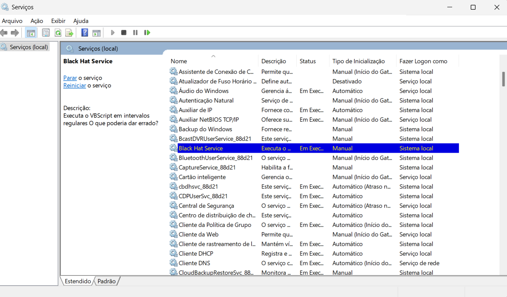

# Capitulo 10 

Nesse capítulo serão abordadas algumas formas de escalonamento de privilégios numa máquina Windows.

## Escalonamento de privilégios no Windows

Inspirando-se na situação de que você adiquiriu acesso a uma máquina Windows e você deseja se aproveitar das funcionalidades do OS para ter mais privilégios. Nossa abordagem, de acordo com os autores, envolveria explorar drivers mal-programados ou problemas no kernel do Windows, mas sem prejudicar a estabilidade do sistema. Exploraremos maneiras diferentes de escalar privilégios no Windows.

É falado que administradores de sistemas agendam tarefas ou serviços frequentemente, usando processos secundários ou [VBScript](https://pt.wikipedia.org/wiki/VBScript)/Powershell. A ideia é se aproveitar desses processos de privilégio alto para usar nossos próprios códigos binários para executar funções.

Iremos começar aprendenrdo a usar a programação da Instrumentação de Gerenciamento do Windows (Windows Management Instrumentation, WMI) para criar uma interface de monitoramento da criação de novos processos. Buscaremos caminhos de arquivo, o usuário que criou os processos e os privilégios usados. 

Feito isso, usaremos um script de monitoramento de arquivos para verificar quando um novo arquivo é criado, bem como o conteúdo dele. Agora, finalmente, interceptaremos o processo de criação de arquivos para injetar nosso script nele e, em seguida, faremos um processo de alto privilégio executá-lo.

Note que não usamos em nenhum momento hooks de API, tornando nosso método vantajoso pois ele pode passar despercebido pela maioria dos antivírus.

### Instalando os pré-requisitos

Instale as libs `pywin32`, `wmi` e `pyinstaller` através de:

```bash
pip install pywin32 wmi pyinstaller
```

### Criando o serviço vulnerável BlackHat

Os autores afirmam que simularemos vulnerabilidades presentes em redes corporativas de grande porte. Vamos começar fazendo um código que copia um script para um diretório temporário e executa-o. Em `service.py`:

```py
# Aqui fazemos os imports básicos

import os   # Biblioteca padrão para interagir com o sistema operacional e manipular variáveis de ambiente, caminhos de arquivos, etc.
import servicemanager # Biblioteca que fornece ferramentas para criar, gerenciar e interagir com serviços do Windows, útil para registros de eventos.
import shutil   # Biblioteca padrão que permite copiar, mover, renomear e manipular arquivos e diretórios.
import subprocess   # Biblioteca padrão usada para executar e gerenciar subprocessos, como executar comandos do sistema.
import sys  # Biblioteca padrão para acessar funcionalidades relacionadas ao sistema, como argumentos da linha de comando e encerramento do programa.
import win32event   # Parte do pacote pywin32, usada para criar e manipular eventos no sistema operacional Windows.
import win32service # Parte do pacote pywin32, usada para criar, configurar e gerenciar serviços do Windows.
import win32serviceutil # Parte do pacote pywin32, fornece utilitários para facilitar o gerenciamento de serviços do Windows, como instalação e remoção.


# Os diretórios onde tem o arquivo original e para onde vai o arquivo temporário
SRCDIR = 'C:\\Users\\caioe\\Documents\\Projetos\\BHPython\\c10\\dir'
TGTDIR = 'C:\\Users\\caioe\\Documents\\Projetos\\BHPython\\c10\\temp'
```

Em seguida, criaremos a classe que representará o nosso serviço:

```py
# Define uma classe que herda de win32serviceutil.ServiceFramework para criar um serviço no Windows
class ServerSvc(win32serviceutil.ServiceFramework):
    # Nome interno do serviço no sistema
    _svc_name = "BlackHatService"
    # Nome exibido para os usuários no Gerenciador de Serviços
    _svc_display_name_ = "Black Hat Service"
    # Descrição do serviço que será exibida nas propriedades do serviço
    _svc_description_ = (
        "Executa o VBScript em intervalos regulares" +
        " O que poderia dar errado?"
    )
    
    # Método inicializador da classe (construtor)
    def __init__(self, args):
        # Define o caminho para o arquivo VBScript a ser executado
        self.vbs = os.path.join(TGTDIR, 'bhservice_task.vbs')
        # Define o tempo de espera em milissegundos (1 minuto)
        self.timeout = 1000 * 60
        
        # Chama o inicializador da classe base para configurar o serviço
        win32serviceutil.ServiceFramework.__init__(self, args)
        # Cria um evento que será usado para sinalizar quando o serviço deve parar
        self.hWaitStop = win32event.CreateEvent(None, 0, 0, None)
    
    # Método chamado quando o serviço é solicitado para parar
    def SvcStop(self):
        # Reporta que o serviço está em processo de parada
        self.ReportServiceStatus(win32service.SERVICE_STOP_PENDING)
        # Sinaliza o evento para indicar que o serviço deve encerrar
        win32event.SetEvent(self.hWaitStop)
    
    # Método chamado quando o serviço é solicitado para iniciar
    def SvcDoRun(self):
        # Reporta que o serviço está em execução
        self.ReportServiceStatus(win32service.SERVICE_RUNNING)
        # Chama o método principal que contém a lógica do serviço
        self.main()
```

A função `self.main()` por sua vez, executará a lógica do serviço, implementaremos ela da seguinte maneira:

```py
# Método principal do serviço, responsável pela lógica de execução contínua
def main(self):
    # Loop principal do serviço
    while True:
        # Aguarda que o evento de parada seja sinalizado ou que o tempo de timeout expire
        ret_code = win32event.WaitForSingleObject(
            self.hWaitStop, self.timeout
        )
        # Verifica se o evento foi abandonado (indica que o serviço deve encerrar)
        if ret_code == win32event.WAIT_ABANDONED_0:
            # Loga uma mensagem informando que o serviço está sendo encerrado
            servicemanager.LogInfoMsg("O serviço está sendo encerrado")
            # Sai do loop principal, encerrando a execução
            break
        
        # Define o caminho do script-fonte (VBScript) que será copiado
        src = os.path.join(SRCDIR, 'bhservice_task.vbs')
        # Copia o script-fonte para o local especificado no serviço
        shutil.copy(src, self.vbs)
        # Executa o script VBScript usando o interpretador `cscript.exe`
        subprocess.call("cscript.exe %s" % self.vbs, shell=False)
        # Remove o script copiado após a execução
        os.unlink(self.vbs)

# Código principal que será executado quando o script for iniciado diretamente
if __name__ == '__main__':
    # Verifica se o script foi chamado sem argumentos (modo serviço)
    if len(sys.argv) == 1:
        # Inicializa o gerenciamento do serviço
        servicemanager.Initialize()
        # Prepara o serviço para rodar como um serviço do Windows
        servicemanager.PrepareToHostSingle(ServerSvc)
        # Inicia o despachante de controle do serviço
        servicemanager.StartServiceCtrlDispatcher()
    
    # Caso contrário, interpreta os argumentos da linha de comando para manipular o serviço
    else:
        win32serviceutil.HandleCommandLine(ServerSvc)
```

Para usálo, primeiro criaremos um executável standalone para que possamos usar esse código:

```bash
pyinstaller -F --hiddenimport win32timezone service.py
```

- `-F` ou `--onefile` significa que criaremos um único arquivo para a execução
- `--hiddenimport win32timezone` garante que o PyInstaller inclua o módulo win32timezone, que pode ser usado implicitamente por bibliotecas como pywin32. Sem isso, o executável pode falhar ao ser executado

Com o executável em mãos, faremos com que ele seja instalado no Windows no **CMD de adiministrador** através de:

```bash
service.exe install
```

Agora ele está instalado como serviço. Você pode visualizá-lo no aplicativo do Gerenciador de Serviços do Windows:



Mas ele não estaria iniciado ainda. Para iniciá-lo:

```bash
service.exe start
```

Agora, a cada timeout (1000*60 ms = 1min) o serviço copiará o arquivo do `SRCDIR` e o enviará para o `TGTDIR` para executá-lo em seguida. Depois ele o excluirá. Ele continuará nesse loop até você usar

```bash
service.exe stop
```

E, assim que ele terminar o processo de stop, você pode excluí-lo com:


```bash
service.exe remove
```

Você também é capaz de fazer isso através do menu do Gerenciador de Serviços.

Caso ele esteja demorando para finalizar, você pode executar:

```bash
sc queryex <TITULO DO PROCESSO>
taskkill /PID <PID_DO_PROCESSO> /F
service.exe remove
```

**OBSERVAÇÃO**: Existem scripts que travam a execução do serviço, por traterem de funções indisponíveis para esse tipo de processo (Ex: scripts que tenham Message Box, que envolve interface gráfica > **A mensagem não será exibida na GUI, porque serviços executam em uma sessão isolada (Session 0) e não têm acesso direto à interface do usuário**). Você pode debugar o seu script usando o que eu usei:

```vbs
' Substituindo MsgBox por um log
Dim objFSO, objFile
Set objFSO = CreateObject("Scripting.FileSystemObject")
Set objFile = objFSO.OpenTextFile("C:\Users\caioe\Documents\Projetos\BHPython\c10\temp\log.txt", 8, True)

objFile.WriteLine "AHAHAHAHAHAHAHAAH - Executado em " & Now
objFile.Close
```
