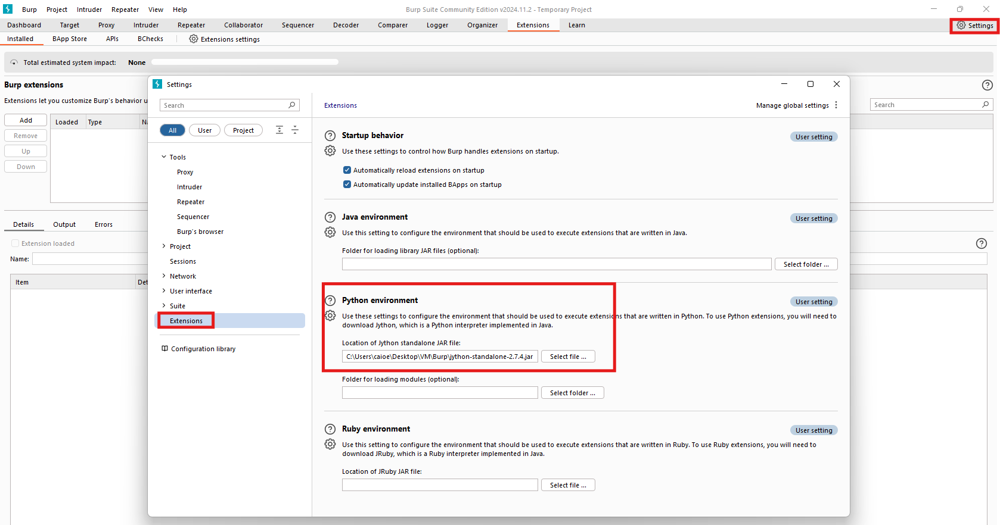
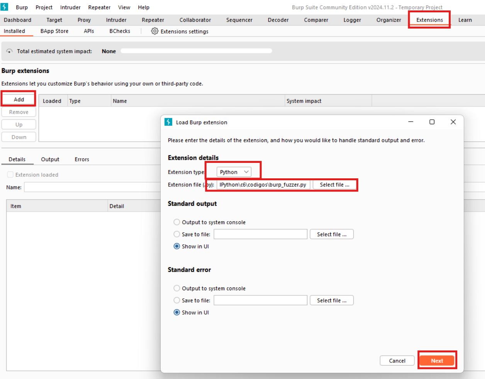
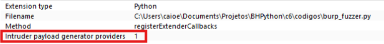
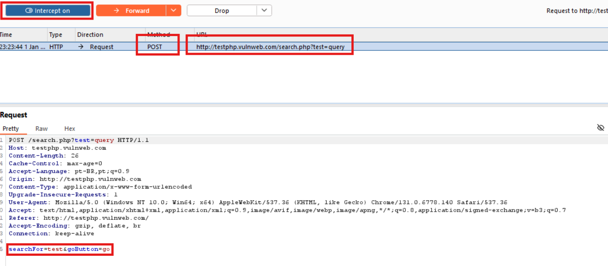
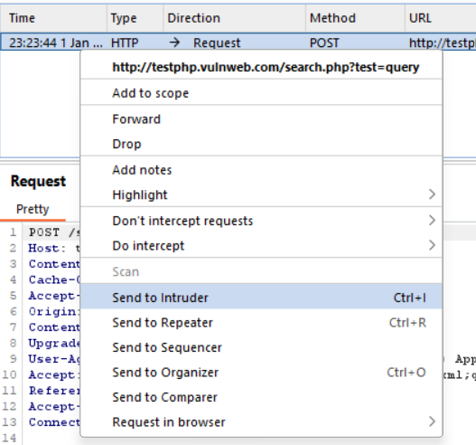
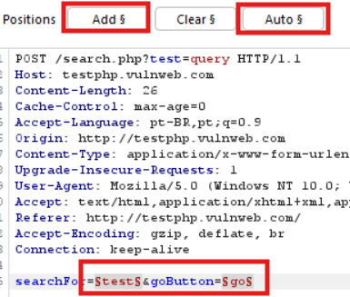
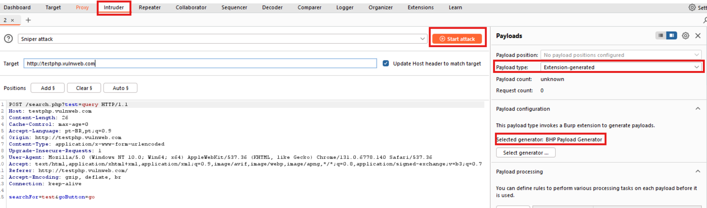
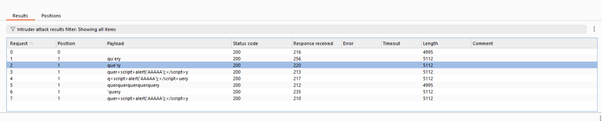

# Capitulo 6 

Neste capítulo, dedicaremos um tempo para o estudo do software Burp Suite, da PortSwigger. 

## Estendendo o proxy do Burp

Primeiramente, para este capítulo, vale mencionar que, se você alguma vez já mexeu com segurança/invasão de aplicações web, provavelmente você já utilizou o BurpSuite. Ele oferece uma série de funcionalidades para o usuário, desde *spiders* (que rastreiam um pacote até seu endereço de destino final) até mesmo *proxy*, que é um tópico já estudado em outros capítulos. O proxy do Burp é diferente do nosso pois ele capta e modifica pacotes por meio de uma interface, que facilita o trabalho.

Agora, como objetivos, serão explorados algumas funcionalidades específicas do Burp, as extensões. Nossa meta é entender como elas são feitas e como podemos usá-las para técnicas de exploração. Nós iremos criar 3 extensões:

- Uma para utilizar uma solicitação HTTP interceptada pelo proxy como base para um [fuzzer de mutação](https://pt.wikipedia.org/wiki/Fuzzing) que, por sua vez, será usado no Intruder. Basicamente uma técnica de criar um fuzzer usando o Proxy e executá-lo
- Outra para se comunicar com a API da Microsoft Bing para mostrar todos os hosts virtuais localizados no mesmo endereço de IP do site de destino, além dos subdomínios detectados para o doínio de destino.
- Por fim, uma extensão para gerar uma wordlist com base em um site de destino para uso em ataques de força bruta.

### Configurando o Burp Suite

Nas máquinas Kali, ele já vem instalado por default. Contudo, como estou utilizando Windows, instalei-o através do [link de download](https://portswigger.net/burp/releases/). 

Além disso, será necessária a [instalação do Jython](https://repo1.maven.org/maven2/org/python/jython-standalone/), uma implementação do Python 2 feita em Java. Como o Jython utiliza o Python 2, os autores abriram uma execeção no andamento do livro (que até então era exclusivamente em Python 3) para utilizá-lo. Eles instruem para instalar a versão pelo instalador Standalone e salvar o seu .JAR em um local de fácil acesso.

Para rodar o Jython use:

```bash
java -jar jython-standalone-2.7.4.jar codigo.py
```

Com o Burp inicializado, clique na guia *Settings*, vá em *Extensions* e procure o JAR da versão Standalone lá:



### Realizando fuzzing com o Burp

Um breve resumo sobre fuzzing, do ChatGPT: 

```
Fuzzing é uma técnica de teste de software que envolve a geração automática de entradas inesperadas ou aleatórias para um programa, com o objetivo de identificar falhas, vulnerabilidades ou comportamentos inesperados. Essas entradas, chamadas de fuzz inputs, são projetadas para explorar possíveis pontos fracos na lógica do software, como estouro de buffer, erros de validação ou condições de corrida. A técnica é amplamente usada em segurança cibernética para detectar vulnerabilidades exploráveis e em garantia de qualidade para melhorar a robustez do sistema, fornecendo dados que podem ajudar a corrigir defeitos antes que eles sejam explorados ou causem falhas em produção.
```

O Burp oferece diversas ferramentas de manipulação de payload. O fluxo padrão é: `captura de solicitação no proxy >> encontra alguma interessante >> encaminha para outra ferramenta do Burp`. Pode-se usar o Repeater, que reproduz o tráfego web... entre outros. Usaremos o Intruder, que tenta descobrir atutomaticamente quais áreas do tráfego web podem ser modificadas e, logo, podem ser atacadas.

Nessa parte do livro, os autores explicam como funciona a [API do Burp](https://portswigger.net/burp/extender/api/burp/) para as classes [`IIntruderPayloadGeneratorFactory`](https://portswigger.net/burp/extender/api/burp/iintruderpayloadgeneratorfactory.html) (fábrica de objetos `PayloadGenerator`) e [`IIntruderPayloadGenerator`](https://portswigger.net/burp/extender/api/burp/iintruderpayloadgenerator.html) (gerador de payloads). 

Sobre a `IIntruderPayloadGeneratorFactory`, em Java, temos a seguinte abstração:

```java
/**
* As extensões podem implementar esta interface e, em seguida, chamar
* IBurpExtenderCallbacks.registerIntruderPayloadGeneratorFactory()
* para registrar uma fábrica de cargas úteis personalizadas para o Intruder.
*/
public interface IIntruderPayloadGeneratorFactory
{
/**
* Este método é usado pelo Burp para obter o nome do gerador
* de cargas úteis. Esse nome será exibido como uma opção
* na interface do Intruder quando o usuário selecionar usar
* cargas úteis geradas pela extensão.
*
* @return O nome do gerador de cargas úteis.
*/
String getGeneratorName();
/**
* Este método é usado pelo Burp quando o usuário inicia um ataque
* do Intruder que utiliza este gerador de cargas úteis.
* @param attack
* Um objeto IIntruderAttack que pode ser consultado para
* obter detalhes sobre o ataque no qual o gerador de
* cargas úteis será usado.
* @return Uma nova instância de IIntruderPayloadGenerator
* que será usada para gerar cargas úteis para o ataque.
*/
IIntruderPayloadGenerator createNewInstance(IIntruderAttackattack);
}
```

Logo, ao analisar o código, é possível entender:

- O primeiro trecho de documentação mostra como registrar corretamente a extensão no Burp. Vamos extender a classe principal do Burp e a classe `IIntruderPayloadGeneratorFactory`. 
- O Burp chamará o método `getGeneratorName()`, para obter o nome da extensão (string).
- O método `createNewInstance()` espera que retornemos uma instância do gerador de payload, que criaremos.

Utilize:

`pip install burp`

Para instalar a lib do burp para Python. Isso ajudará como referência para os códigos, mas não será compilado no nosso Python 3.

No arquivo `burp_fuzzer.py`, deveremos criar as respectivas funções que estão sendo chamadas pela `Factory`, para que possamos superpô-las:

```py
# Importa as interfaces necessárias do Burp Suite.
from burp import IBurpExtender
from burp import IIntruderPayloadGeneratorFactory
from burp import IIntruderPayloadGenerator

# Importa utilitários do Java para manipulação de listas.
from java.util import List, ArrayList

# Importa a biblioteca de geração de números aleatórios.
import random

# Classe principal que implementa as interfaces IBurpExtender e IIntruderPayloadGeneratorFactory.
class BurpExtender(IBurpExtender, IIntruderPayloadGeneratorFactory):
    
    # Método chamado pelo Burp Suite ao carregar a extensão.
    def registerExtenderCallbacks(self, callbacks):
        # Armazena os callbacks fornecidos pelo Burp Suite.
        self._callbacks = callbacks
        self._helpers = callbacks.getHelpers()  # Obtém utilitários auxiliares do Burp.

        # Registra esta classe como uma fábrica de geradores de carga útil (payloads) personalizados.
        callbacks.registerIntruderPayloadGeneratorFactory(self)

        return  # Finaliza o método.
    
    # Método para retornar o nome do gerador de payloads.
    def getGeneratorName(self):
        # Este nome será exibido na interface do usuário do Intruder.
        return "BHP Payload Generator"
    
    # Método para criar uma nova instância do gerador de payloads.
    def createNewInstance(self, attack):
        # Retorna uma instância da classe BHPFuzzer, passando informações sobre o ataque.
        return BHPFuzzer(self, attack)
```

Com uma abstração da interface em mãos, analisaremos o código do `IIntruderPayloadGenerator`, em Java:

```java
/**
* Esta interface é usada para geradores de carga útil 
* personalizados do Intruder.
* As extensões que registraram um 
* IIntruderPayloadGeneratorFactory devem retornar uma nova 
* instância desta interface quando necessário, como parte de um 
* novo ataque do Intruder.
*/
public interface IIntruderPayloadGenerator
{
/**
* Este método é usado pelo Burp para determinar se o 
* gerador de carga útil é capaz de fornecer mais cargas úteis.
*
* @return As extensões devem retornar
* false quando todas as cargas úteis disponíveis forem utilizadas,
* caso contrário, true.
*/
boolean hasMorePayloads();
/**
* Este método é usado pelo Burp para obter o valor da próxima 
* carga útil.
*
* @param baseValue O valor base da posição atual da carga útil.
* Este valor pode ser nulo se o conceito de valor base não se 
* aplicar (por exemplo, em um ataque de aríete).
* @return A próxima carga útil a ser usada no ataque.
*/
 byte[] getNextPayload(byte[] baseValue);
/**
* Este método é usado pelo Burp para redefinir o estado do 
* gerador de carga útil para que a próxima chamada de 
* getNextPayload() retorne a primeira carga útil novamente. Este 
* método será invocado quando um ataque usar o mesmo gerador de 
* carga útil para mais de uma posição de carga útil, por exemplo, 
* em um ataque sniper.
*/
 void reset();
}
```

Complementando o código do `burp_fuzzer.py`, que herda o código anterior, com o entendimento das abstrações da função Java:

```py
from burp import IBurpExtender
from burp import IIntruderPayloadGeneratorFactory
from burp import IIntruderPayloadGenerator

from java.util import List, ArrayList

import random

class BurpExtender(IBurpExtender, IIntruderPayloadGeneratorFactory):
    def registerExtenderCallbacks(self, callbacks):
        self._callbacks = callbacks
        self._helpers   = callbacks.getHelpers()
        
        callbacks.registerIntruderPayloadGeneratorFactory(self)
        
        return
    
    def getGeneratorName(self):
        return "BHP Payload Generator"
    
    def createNewInstance(self, attack):
        return BHPFuzzer(self,attack)

# Classe BHPFuzzer que implementa a interface IIntruderPayloadGenerator.
class BHPFuzzer(IIntruderPayloadGenerator):
    # Inicializa a classe com as informações necessárias para realizar fuzzing.
    def __init__(self, extender, attack):
        self._extender = extender  # Referência à extensão principal.
        self._helpers = extender._helpers()  # Utilitários auxiliares do Burp.
        self._attack = attack  # Detalhes do ataque fornecidos pelo Intruder.
        self.max_payloads = 10  # Número máximo de cargas úteis (payloads) a gerar.
        self.num_interactions = 0  # Contador de interações (payloads gerados).
        return
    
    # Método para verificar se há mais payloads a serem gerados.
    def hasMorePayloads(self):
        # Retorna False se o número de interações atingir o máximo permitido.
        if self.num_interactions == self.max_payloads:
            return False
        else: 
            return True
    
    # Gera o próximo payload com base no payload atual.
    def getNextPayload(self, current_payload):
        # Converte o payload atual de uma lista de bytes para uma string.
        payload = "".join(chr(x) for x in current_payload)
        
        # Realiza a mutação do payload para criar uma nova carga útil.
        payload = self.mutate_payload(payload)
        
        # Incrementa o número de interações para rastrear a quantidade de payloads gerados.
        self.num_interactions += 1
        
        return payload  # Retorna o payload modificado.
    
    # Reseta o estado do gerador para permitir um novo ataque.
    def reset(self):
        self.num_interactions = 0  # Reinicia o contador de interações.
        return
    
    # Método para realizar mutações no payload original.
    def mutate_payload(self, original_payload):
        # Escolhe um tipo de mutação aleatoriamente (1 a 3).
        picker = random.randint(1, 3)
        
        # Escolhe um ponto aleatório no payload para aplicar a mutação.
        offset = random.randint(0, len(original_payload) - 1)
        
        # Divide o payload original em duas partes: antes e depois do ponto de mutação.
        front, back = original_payload[:offset], original_payload[offset:]
        
        # Caso 1: Insere uma tentativa de injeção de SQL no ponto de mutação.
        if picker == 1:
            front += "'"
        
        # Caso 2: Insere uma tentativa de injeção de XSS no ponto de mutação.
        elif picker == 2:
            front += "<script>alert('AAAAA');</script>"
        
        # Caso 3: Repete um trecho aleatório do payload original.
        elif picker == 3:
            # Escolhe um comprimento aleatório para o trecho a ser repetido.
            chunk_length = random.randint(0, len(back) - 1)
            
            # Define o número de vezes que o trecho será repetido.
            repeater = random.randint(1, 10)
            
            # Repete o trecho escolhido e adiciona ao front.
            for _ in range(repeater):
                front += original_payload[:offset + chunk_length]
        
        # Retorna o payload modificado.
        return front + back
```

Até agora, o código mostra como desenvolver uma extensão personalizada para o Burp Suite, focando na criação de um gerador de payloads personalizado para o Intruder, ferramenta do Burp utilizada para realizar ataques automatizados. 

A classe `BurpExtender` implementa as interfaces necessárias (`IBurpExtender` e `IIntruderPayloadGeneratorFactory`) e registra a extensão como uma fábrica de geradores de payloads.

 O nome do gerador é definido no método `getGeneratorName`, e o método `createNewInstance` cria uma nova instância do gerador de payloads `BHPFuzzer`, que será usado no ataque Intruder. Isso demonstra como registrar uma extensão no Burp e como ela pode interagir com a interface de ataques automatizados.

A classe `BHPFuzzer` é responsável por gerar os payloads que serão usados no ataque Intruder. Ela implementa a interface `IIntruderPayloadGenerator` e contém métodos que controlam a lógica do fuzzing, como o limite de tentativas de payloads, a geração do próximo payload e a mutação dos payloads. O método `mutate_payload` exemplifica como a técnica de fuzzing pode ser aplicada a um payload original, modificando-o com injeções de SQL, XSS ou repetições de trechos. 

Isso ensina como personalizar a geração de payloads no Burp para explorar diferentes tipos de vulnerabilidades em um sistema, além de fornecer uma base para quem deseja criar suas próprias ferramentas de teste automatizado no Burp Suite.

### Explorando o código

Para usar o código, agora, vamos no Burp Suite e adicionemos a extensão. Na aba Extensions, clique em Add, e, em seguida, coloque a linguagem para Python (já que estamos usando o Jython). Finalmente, selecione o código feito e clique em Next:



Verifique se houveram erros na aba Erros. 

Ao clicar em Close, vemos na tabela abaixo que o Burp identificou nosso código como um gerador de payloads com o Intruder:



Agora, vamos em Proxy e iniciaremos o navegador com Open Browser. Se você nunca usou o Proxy do Burp, recomendo que você veja algum vídeo no youtube ou experimente por si só. 

Veremos o link *http://testphp.vulnweb.com*. Ao carregar a página, ligue o Intercept e pesquiste, no site, por "teste":


Veremos o payload da request.



Clique com o botão direito na request e clique em Send to Intruder:



Mude para a aba Intruder, vá na aba Payload e selecione Extension-generated. Em seguida, selecione o BHP Payload Generator, que nomeamos mais cedo.

Como ele entende quais os campos são mutáveis para o payload, podemos clicar em Auto$ para adicionar tais campos. É possível modificar o payload manualmente em Add$. 



Agora, clique em Start Attack para iniciarmos o ataque.



**OBSERVAÇÃO** Se houverem erros de execução, é possíver ver na aba Extensions, clicando na extensão e vendo na sua aba Errors. Isso indicará erros de compilação/execução.

O output mostrado foi:



Mostrando que o site é vulnerável a SQL injection.
