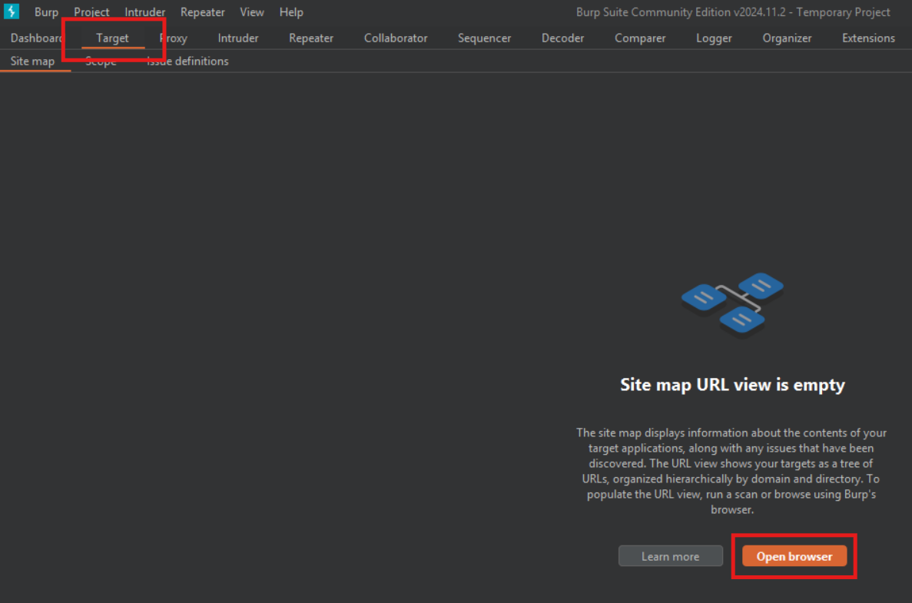
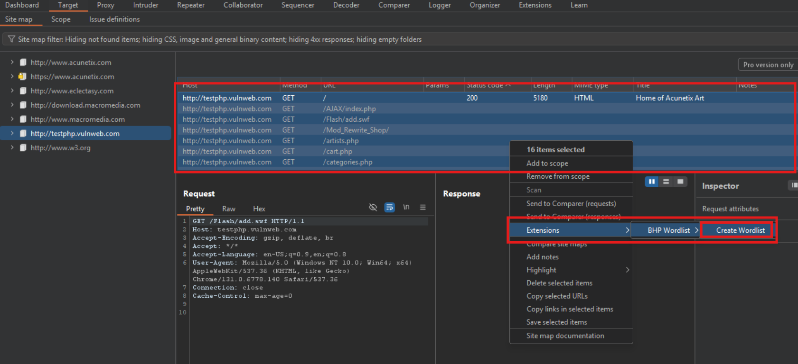

# Capitulo 6 

Neste capítulo, dedicaremos um tempo para o estudo do software Burp Suite, da PortSwigger. 

## Estendendo o proxy do Burp

Primeiramente, para este capítulo, vale mencionar que, se você alguma vez já mexeu com segurança/invasão de aplicações web, provavelmente você já utilizou o BurpSuite. Ele oferece uma série de funcionalidades para o usuário, desde *spiders* (que rastreiam um pacote até seu endereço de destino final) até mesmo *proxy*, que é um tópico já estudado em outros capítulos. O proxy do Burp é diferente do nosso pois ele capta e modifica pacotes por meio de uma interface, que facilita o trabalho.

Agora, como objetivos, serão explorados algumas funcionalidades específicas do Burp, as extensões. Nossa meta é entender como elas são feitas e como podemos usá-las para técnicas de exploração. Nós iremos criar 3 extensões:

- Uma para utilizar uma solicitação HTTP interceptada pelo proxy como base para um [fuzzer de mutação](https://pt.wikipedia.org/wiki/Fuzzing) que, por sua vez, será usado no Intruder. Basicamente uma técnica de criar um fuzzer usando o Proxy e executá-lo
- Outra para se comunicar com a API da Microsoft Bing para mostrar todos os hosts virtuais localizados no mesmo endereço de IP do site de destino, além dos subdomínios detectados para o doínio de destino.
- Por fim, uma extensão para gerar uma wordlist com base em um site de destino para uso em ataques de força bruta.

### Configurando o Burp Suite

Nas máquinas Kali, ele já vem instalado por default. Contudo, como estou utilizando Windows, instalei-o através do [link de download](https://portswigger.net/burp/releases/). 

Além disso, será necessária a [instalação do Jython](https://repo1.maven.org/maven2/org/python/jython-standalone/), uma implementação do Python 2 feita em Java. Como o Jython utiliza o Python 2, os autores abriram uma execeção no andamento do livro (que até então era exclusivamente em Python 3) para utilizá-lo. Eles instruem para instalar a versão pelo instalador Standalone e salvar o seu .JAR em um local de fácil acesso.

Para rodar o Jython use:

```bash
java -jar jython-standalone-2.7.4.jar codigo.py
```

Com o Burp inicializado, clique na guia *Settings*, vá em *Extensions* e procure o JAR da versão Standalone lá:


### Realizando fuzzing com o Burp

Um breve resumo sobre fuzzing, do ChatGPT: 

```
Fuzzing é uma técnica de teste de software que envolve a geração automática de entradas inesperadas ou aleatórias para um programa, com o objetivo de identificar falhas, vulnerabilidades ou comportamentos inesperados. Essas entradas, chamadas de fuzz inputs, são projetadas para explorar possíveis pontos fracos na lógica do software, como estouro de buffer, erros de validação ou condições de corrida. A técnica é amplamente usada em segurança cibernética para detectar vulnerabilidades exploráveis e em garantia de qualidade para melhorar a robustez do sistema, fornecendo dados que podem ajudar a corrigir defeitos antes que eles sejam explorados ou causem falhas em produção.
```

O Burp oferece diversas ferramentas de manipulação de payload. O fluxo padrão é: `captura de solicitação no proxy >> encontra alguma interessante >> encaminha para outra ferramenta do Burp`. Pode-se usar o Repeater, que reproduz o tráfego web... entre outros. Usaremos o Intruder, que tenta descobrir atutomaticamente quais áreas do tráfego web podem ser modificadas e, logo, podem ser atacadas.

Nessa parte do livro, os autores explicam como funciona a [API do Burp](https://portswigger.net/burp/extender/api/burp/) para as classes [`IIntruderPayloadGeneratorFactory`](https://portswigger.net/burp/extender/api/burp/iintruderpayloadgeneratorfactory.html) (fábrica de objetos `PayloadGenerator`) e [`IIntruderPayloadGenerator`](https://portswigger.net/burp/extender/api/burp/iintruderpayloadgenerator.html) (gerador de payloads). 

Sobre a `IIntruderPayloadGeneratorFactory`, em Java, temos a seguinte abstração:

```java
/**
* As extensões podem implementar esta interface e, em seguida, chamar
* IBurpExtenderCallbacks.registerIntruderPayloadGeneratorFactory()
* para registrar uma fábrica de cargas úteis personalizadas para o Intruder.
*/
public interface IIntruderPayloadGeneratorFactory
{
/**
* Este método é usado pelo Burp para obter o nome do gerador
* de cargas úteis. Esse nome será exibido como uma opção
* na interface do Intruder quando o usuário selecionar usar
* cargas úteis geradas pela extensão.
*
* @return O nome do gerador de cargas úteis.
*/
String getGeneratorName();
/**
* Este método é usado pelo Burp quando o usuário inicia um ataque
* do Intruder que utiliza este gerador de cargas úteis.
* @param attack
* Um objeto IIntruderAttack que pode ser consultado para
* obter detalhes sobre o ataque no qual o gerador de
* cargas úteis será usado.
* @return Uma nova instância de IIntruderPayloadGenerator
* que será usada para gerar cargas úteis para o ataque.
*/
IIntruderPayloadGenerator createNewInstance(IIntruderAttackattack);
}
```

Logo, ao analisar o código, é possível entender:

- O primeiro trecho de documentação mostra como registrar corretamente a extensão no Burp. Vamos extender a classe principal do Burp e a classe `IIntruderPayloadGeneratorFactory`. 
- O Burp chamará o método `getGeneratorName()`, para obter o nome da extensão (string).
- O método `createNewInstance()` espera que retornemos uma instância do gerador de payload, que criaremos.

Utilize:

`pip install burp`

Para instalar a lib do burp para Python. Isso ajudará como referência para os códigos, mas não será compilado no nosso Python 3.

No arquivo `burp_fuzzer.py`, deveremos criar as respectivas funções que estão sendo chamadas pela `Factory`, para que possamos superpô-las:

```py
# Importa as interfaces necessárias do Burp Suite.
from burp import IBurpExtender
from burp import IIntruderPayloadGeneratorFactory
from burp import IIntruderPayloadGenerator

# Importa utilitários do Java para manipulação de listas.
from java.util import List, ArrayList

# Importa a biblioteca de geração de números aleatórios.
import random

# Classe principal que implementa as interfaces IBurpExtender e IIntruderPayloadGeneratorFactory.
class BurpExtender(IBurpExtender, IIntruderPayloadGeneratorFactory):
    
    # Método chamado pelo Burp Suite ao carregar a extensão.
    def registerExtenderCallbacks(self, callbacks):
        # Armazena os callbacks fornecidos pelo Burp Suite.
        self._callbacks = callbacks
        self._helpers = callbacks.getHelpers()  # Obtém utilitários auxiliares do Burp.

        # Registra esta classe como uma fábrica de geradores de carga útil (payloads) personalizados.
        callbacks.registerIntruderPayloadGeneratorFactory(self)

        return  # Finaliza o método.
    
    # Método para retornar o nome do gerador de payloads.
    def getGeneratorName(self):
        # Este nome será exibido na interface do usuário do Intruder.
        return "BHP Payload Generator"
    
    # Método para criar uma nova instância do gerador de payloads.
    def createNewInstance(self, attack):
        # Retorna uma instância da classe BHPFuzzer, passando informações sobre o ataque.
        return BHPFuzzer(self, attack)
```

Com uma abstração da interface em mãos, analisaremos o código do `IIntruderPayloadGenerator`, em Java:

```java
/**
* Esta interface é usada para geradores de carga útil 
* personalizados do Intruder.
* As extensões que registraram um 
* IIntruderPayloadGeneratorFactory devem retornar uma nova 
* instância desta interface quando necessário, como parte de um 
* novo ataque do Intruder.
*/
public interface IIntruderPayloadGenerator
{
/**
* Este método é usado pelo Burp para determinar se o 
* gerador de carga útil é capaz de fornecer mais cargas úteis.
*
* @return As extensões devem retornar
* false quando todas as cargas úteis disponíveis forem utilizadas,
* caso contrário, true.
*/
boolean hasMorePayloads();
/**
* Este método é usado pelo Burp para obter o valor da próxima 
* carga útil.
*
* @param baseValue O valor base da posição atual da carga útil.
* Este valor pode ser nulo se o conceito de valor base não se 
* aplicar (por exemplo, em um ataque de aríete).
* @return A próxima carga útil a ser usada no ataque.
*/
 byte[] getNextPayload(byte[] baseValue);
/**
* Este método é usado pelo Burp para redefinir o estado do 
* gerador de carga útil para que a próxima chamada de 
* getNextPayload() retorne a primeira carga útil novamente. Este 
* método será invocado quando um ataque usar o mesmo gerador de 
* carga útil para mais de uma posição de carga útil, por exemplo, 
* em um ataque sniper.
*/
 void reset();
}
```

Complementando o código do `burp_fuzzer.py`, que herda o código anterior, com o entendimento das abstrações da função Java:

```py
from burp import IBurpExtender
from burp import IIntruderPayloadGeneratorFactory
from burp import IIntruderPayloadGenerator

from java.util import List, ArrayList

import random

class BurpExtender(IBurpExtender, IIntruderPayloadGeneratorFactory):
    def registerExtenderCallbacks(self, callbacks):
        self._callbacks = callbacks
        self._helpers   = callbacks.getHelpers()
        
        callbacks.registerIntruderPayloadGeneratorFactory(self)
        
        return
    
    def getGeneratorName(self):
        return "BHP Payload Generator"
    
    def createNewInstance(self, attack):
        return BHPFuzzer(self,attack)

# Classe BHPFuzzer que implementa a interface IIntruderPayloadGenerator.
class BHPFuzzer(IIntruderPayloadGenerator):
    # Inicializa a classe com as informações necessárias para realizar fuzzing.
    def __init__(self, extender, attack):
        self._extender = extender  # Referência à extensão principal.
        self._helpers = extender._helpers()  # Utilitários auxiliares do Burp.
        self._attack = attack  # Detalhes do ataque fornecidos pelo Intruder.
        self.max_payloads = 10  # Número máximo de cargas úteis (payloads) a gerar.
        self.num_interactions = 0  # Contador de interações (payloads gerados).
        return
    
    # Método para verificar se há mais payloads a serem gerados.
    def hasMorePayloads(self):
        # Retorna False se o número de interações atingir o máximo permitido.
        if self.num_interactions == self.max_payloads:
            return False
        else: 
            return True
    
    # Gera o próximo payload com base no payload atual.
    def getNextPayload(self, current_payload):
        # Converte o payload atual de uma lista de bytes para uma string.
        payload = "".join(chr(x) for x in current_payload)
        
        # Realiza a mutação do payload para criar uma nova carga útil.
        payload = self.mutate_payload(payload)
        
        # Incrementa o número de interações para rastrear a quantidade de payloads gerados.
        self.num_interactions += 1
        
        return payload  # Retorna o payload modificado.
    
    # Reseta o estado do gerador para permitir um novo ataque.
    def reset(self):
        self.num_interactions = 0  # Reinicia o contador de interações.
        return
    
    # Método para realizar mutações no payload original.
    def mutate_payload(self, original_payload):
        # Escolhe um tipo de mutação aleatoriamente (1 a 3).
        picker = random.randint(1, 3)
        
        # Escolhe um ponto aleatório no payload para aplicar a mutação.
        offset = random.randint(0, len(original_payload) - 1)
        
        # Divide o payload original em duas partes: antes e depois do ponto de mutação.
        front, back = original_payload[:offset], original_payload[offset:]
        
        # Caso 1: Insere uma tentativa de injeção de SQL no ponto de mutação.
        if picker == 1:
            front += "'"
        
        # Caso 2: Insere uma tentativa de injeção de XSS no ponto de mutação.
        elif picker == 2:
            front += "<script>alert('AAAAA');</script>"
        
        # Caso 3: Repete um trecho aleatório do payload original.
        elif picker == 3:
            # Escolhe um comprimento aleatório para o trecho a ser repetido.
            chunk_length = random.randint(0, len(back) - 1)
            
            # Define o número de vezes que o trecho será repetido.
            repeater = random.randint(1, 10)
            
            # Repete o trecho escolhido e adiciona ao front.
            for _ in range(repeater):
                front += original_payload[:offset + chunk_length]
        
        # Retorna o payload modificado.
        return front + back
```

Até agora, o código mostra como desenvolver uma extensão personalizada para o Burp Suite, focando na criação de um gerador de payloads personalizado para o Intruder, ferramenta do Burp utilizada para realizar ataques automatizados. 

A classe `BurpExtender` implementa as interfaces necessárias (`IBurpExtender` e `IIntruderPayloadGeneratorFactory`) e registra a extensão como uma fábrica de geradores de payloads.

 O nome do gerador é definido no método `getGeneratorName`, e o método `createNewInstance` cria uma nova instância do gerador de payloads `BHPFuzzer`, que será usado no ataque Intruder. Isso demonstra como registrar uma extensão no Burp e como ela pode interagir com a interface de ataques automatizados.

A classe `BHPFuzzer` é responsável por gerar os payloads que serão usados no ataque Intruder. Ela implementa a interface `IIntruderPayloadGenerator` e contém métodos que controlam a lógica do fuzzing, como o limite de tentativas de payloads, a geração do próximo payload e a mutação dos payloads. O método `mutate_payload` exemplifica como a técnica de fuzzing pode ser aplicada a um payload original, modificando-o com injeções de SQL, XSS ou repetições de trechos. 

Isso ensina como personalizar a geração de payloads no Burp para explorar diferentes tipos de vulnerabilidades em um sistema, além de fornecer uma base para quem deseja criar suas próprias ferramentas de teste automatizado no Burp Suite.

### Explorando o código

Para usar o código, agora, vamos no Burp Suite e adicionemos a extensão. Na aba Extensions, clique em Add, e, em seguida, coloque a linguagem para Python (já que estamos usando o Jython). Finalmente, selecione o código feito e clique em Next:


Verifique se houveram erros na aba Erros. 

Ao clicar em Close, vemos na tabela abaixo que o Burp identificou nosso código como um gerador de payloads com o Intruder:


Agora, vamos em Proxy e iniciaremos o navegador com Open Browser. Se você nunca usou o Proxy do Burp, recomendo que você veja algum vídeo no youtube ou experimente por si só. 

Veremos o link *http://testphp.vulnweb.com*. Ao carregar a página, ligue o Intercept e pesquiste, no site, por "teste":


Veremos o payload da request.


Clique com o botão direito na request e clique em Send to Intruder:


Mude para a aba Intruder, vá na aba Payload e selecione Extension-generated. Em seguida, selecione o BHP Payload Generator, que nomeamos mais cedo.

Como ele entende quais os campos são mutáveis para o payload, podemos clicar em Auto$ para adicionar tais campos. É possível modificar o payload manualmente em Add$. 


Agora, clique em Start Attack para iniciarmos o ataque.


**OBSERVAÇÃO** Se houverem erros de execução, é possíver ver na aba Extensions, clicando na extensão e vendo na sua aba Errors. Isso indicará erros de compilação/execução.

O output mostrado foi:


Mostrando que o site é vulnerável a SQL injection.


### Utilizando o Bing no Burp

A inspiração para essa parte é de que o Bing possui funcionalidades de pesquisa de todos os hosts que possuem o mesmo endereço de IP, ao usar o modificador de pesquisa "IP", bem como todos os subdomínios de um domínio, ao usar o modificador de pesquisa "domínio". Não sabia disso pq eu não uso o Bing.

Agora podemos usar um [*scraper*](https://pt.wikipedia.org/wiki/Web_scraping) para enviar consultas no Bing e obter o HTML dos resultados. *Web scraping* ou só *scraping* é a definição para a extração de dados de brutos de um site para uma análise estruturada. 

Os autores mencionam que, para evitar problemas, é melhor usarmos a API do Bing para enviar as consultas automatizadas e analisar os resultados. Ela se encontra no seguinte [link](https://www.microsoft.com/en-us/bing/apis/bing-web-search-api).

Para utilizá-la é necessário fazer login com a sua conta Microsoft e na Azure, colocar dados do cartão de crédito etc. Não vou fazer isso, então esse código não vai ser testado do jeito que os autores fizeram.

No entanto, nada nos impede de criar a extensão para o Burp, usando os mesmos princípios da anterior. Criaremos uma extensão para enviar consultas automatizadas e, para isso, usaremos um *menu de contexto*, usado para apresentar a interface de pesquisa. Então, em `burp_bing.py`:

```py
# Importações necessárias para integrar o Burp Suite e usar a API do Bing.
from burp import IBurpExtender  # Interface para criar extensões no Burp Suite.
from burp import IContextMenuFactory  # Interface para adicionar itens ao menu de contexto.

from java.net import URL  # Classe Java para manipular URLs.
from java.util import ArrayList  # Estrutura de dados para listas.
from javax.swing import JMenuItem  # Item de menu usado na GUI.
from thread import start_new_thread  # Para criar threads (executar tarefas em paralelo).

import json  # Para manipular dados JSON.
import socket  # Para operações de rede, como resolver nomes de domínio.
import urllib  # Para codificar parâmetros de consulta em URLs.

# Configurações para acessar a API do Bing.
API_KEY = 'SUA CHAVE DA API'  # Chave da API obtida no portal da Azure.
API_HOST = 'api.cognitive.microsoft.com'  # Host para enviar as requisições à API do Bing.

# Classe principal da extensão, implementando as interfaces necessárias.
class BurpExtenser(IBurpExtender, IContextMenuFactory):
    def registerExtenderCallbacks(self, callbacks):
        """
        Método chamado pelo Burp Suite para registrar a extensão.
        """
        self._callbacks = callbacks  # Referência para os métodos do Burp.
        self._helpers = callbacks.getHelpers()  # Auxiliares para manipular HTTP e outros dados.
        self.context = None  # Armazenará o contexto do menu clicado.

        # Configuração inicial da extensão no Burp Suite.
        callbacks.setExtensionName("BHP Bing")  # Nome da extensão.
        callbacks.registerContextMenuFactory(self)  # Registra o menu de contexto.

        return
    
    def createMenuItems(self, context_menu):
        """
        Método para criar itens no menu de contexto.
        """
        self.context = context_menu  # Salva o contexto do clique.
        menu_list = ArrayList()  # Lista de itens para o menu.
        menu_list.add(JMenuItem(
            "Send to Bing", actionPeformed=self.bing_menu))  # Adiciona o item "Send to Bing".
        return menu_list
    
    def bing_menu(self, event):
        """
        Método chamado quando o item "Send to Bing" é selecionado.
        """
        # Obtém as mensagens HTTP selecionadas pelo usuário.
        http_traffic = self.context.getSelectedMessages()
        print("%d solicitações destacadas" % len(http_traffic))  # Exibe o número de seleções.

        for traffic in http_traffic:
            http_service = traffic.getHttpService()  # Detalhes do serviço HTTP.
            host = http_service.getHost()  # Obtém o host associado à mensagem.
            print("Host escolhido pelo usuário: %s" % host)  # Loga o host selecionado.
            self.bing_search(host)  # Realiza a busca no Bing para o host.
        
        return
    
    def bing_search(self, host):
        """
        Realiza uma pesquisa no Bing para o host selecionado.
        """
        # Verifica se o host é um IP ou um nome de domínio.
        try:
            is_ip = bool(socket.inet_aton(host))  # Tenta converter para IP.
        except socket.error:
            is_ip = False  # Não é um IP válido.
        
        if is_ip:
            ip_address = host  # O host é um IP.
            domain = False  # Não é um domínio.
        else:
            ip_address = socket.gethostbyname(host)  # Resolve o IP a partir do domínio.
            domain = True  # É um domínio.

        # Cria threads para realizar consultas separadas para IP e domínio.
        start_new_thread(self.bing_query, ('ip:%s' % ip_address,))
        if domain:
            start_new_thread(self.bing_query, ('domain:%s' % host,))
    
    def bing_query(self, bing_query_string):
        """
        Realiza a consulta à API do Bing e processa os resultados.
        """
        print('Realizando pesquisa no Bing: %s' % bing_query_string)
        # Cria a requisição HTTP.
        http_request = 'GET https://%s/bing/v7.0/search?' % API_HOST
        http_request += 'q=%s HTTP/1.1\r\n' % urllib.quote(bing_query_string)  # Codifica a consulta.
        http_request += 'Host: %s\r\n' % API_HOST
        http_request += 'Connection:close\r\n'
        http_request += 'Ocp-Apim-Subscription-Key: %s\r\n' % API_KEY  # Cabeçalho com a chave da API.
        http_request += 'User-Agent: Black Hat Python\r\n'

        # Envia a requisição usando os métodos do Burp e obtém a resposta.
        json_body = self._callbacks.makeHttpRequest(
            API_HOST, 443, True, http_request).toString()
        json_body = json_body.split('\r\n\r\n', 1)[1]  # Divide cabeçalhos e corpo da resposta.

        try:
            response = json.loads(json_body)  # Tenta carregar a resposta como JSON.
        except (TypeError, ValueError) as err:
            print('O Bing não retornou nenhum resultado: %s' % err)  # Erro ao processar a resposta.
        else:
            sites = list()
            if response.get('webPages'):
                sites = response['webPages']['value']  # Extrai os resultados relevantes.
            if len(sites):
                # Exibe e processa cada resultado.
                for site in sites:
                    print('*' * 100)
                    print('Nome: %s         ' % site['name'])
                    print('URL: %s          ' % site['url'])
                    print('Descrição: %r    ' % site['snippet'])
                    print('*' * 100)

                    java_url = URL(site['url'])  # Cria um objeto URL.
                    if not self._callbacks.isInScope(java_url):
                        print('Adicionando %s ao escopo do Burp' % site['url'])
                        self._callbacks.includeInScope(java_url)  # Adiciona ao escopo do Burp.
            else:
                print('O Bing retornou uma resposta vazia: %s' % bing_query_string)
        
        return
```

Ele basicamente adiciona uma nova opção ao menu de contexto (pequeno menu ao clicar com o botão direito)

### Explorando o código

Como afirmei antes, não me interessei em testá-lo, pois envolvia criar uma conta na Azure e colocar meu cartão de crédito. Mas sinta-se livre para testar, já que os autores testaram e deu certo. Os prints aparecem no menu de Extensão e, no menu Target > Scope, aparecem os hosts.

### Transformando conteúdo de sites em senhas valiosas

A inspiração para esse código é criar uma wordlist personalizada, usando o scraping do site, para enventuais senhas a serem bruteforçadas.

Seguindo a mesma lógica do `IContextMenu`, criaremos uma opção de *clique com o botão direito* para colher as strings relevantes de um site para usar em uma wordlist. Em `burp_scrap.py`:

**OBSERVAÇÃO**: Eu useri um `pip install htmlparser` por fins de ajuda a codar.

```py
# Importações necessárias para criar uma extensão no Burp Suite.
from burp import IBurpExtender  # Interface para criar extensões.
from burp import IContextMenuFactory  # Interface para adicionar itens ao menu de contexto.

# Importações para manipulação de menus e estruturas de dados no Java.
from java.util import ArrayList  # Lista dinâmica usada no Java.
from javax.swing import JMenuItem  # Item do menu que será exibido no Burp Suite.

# Importações para processamento de texto e manipulação de HTML.
from datetime import datetime  # Para trabalhar com datas.
from HTMLParser import HTMLParser  # Classe para remover tags HTML do conteúdo.

import re  # Biblioteca para expressões regulares.

# Classe personalizada para remover tags HTML e extrair texto visível.
class TagStripper(HTMLParser):
    def __init__(self):
        """
        Inicializa o parser HTML e uma lista para armazenar o texto extraído.
        """
        HTMLParser.__init__(self)  # Chama o inicializador da classe base.
        self.page_text = []  # Lista que armazenará os dados extraídos.

    def handle_data(self, data):
        """
        Método chamado para processar o texto encontrado entre as tags.
        """
        self.page_text.append(data)  # Adiciona o texto à lista.

    def handle_comment(self, data):
        """
        Método chamado para processar comentários HTML.
        """
        self.page_text.append(data)  # Adiciona os comentários à lista.

    def strip(self, html):
        """
        Método que processa o HTML fornecido e retorna o texto limpo.
        """
        self.feed(html)  # Processa o HTML.
        return " ".join(self.page_text)  # Retorna todo o texto como uma única string.

# Classe principal da extensão, implementando as interfaces necessárias.
class BurpExtender(IBurpExtender, IContextMenuFactory):
    def registerExtenderCallbacks(self, callbacks):
        """
        Método chamado pelo Burp Suite para registrar a extensão.
        """
        self._callbacks = callbacks  # Referência para métodos do Burp Suite.
        self._helpers = callbacks.getHelpers()  # Auxiliares para manipulação de dados.
        self.context = None  # Armazenará o contexto do menu de clique.
        self.hosts = set()  # Conjunto para armazenar os hosts processados.

        # Inicia a wordlist com uma palavra comum.
        self.wordlist = set(["senha"])

        # Configurações iniciais da extensão.
        callbacks.setExtensionName("BHP Wordlist")  # Define o nome da extensão.
        callbacks.registerContextMenuFactory(self)  # Registra o menu de contexto.

    def createMenuItems(self, context_menu):
        """
        Método para criar itens no menu de contexto.
        """
        self.context = context_menu  # Salva o contexto do clique.
        menu_list = ArrayList()  # Lista de itens do menu.
        # Adiciona o item "Create Wordlist" ao menu.
        menu_list.add(JMenuItem("Create Wordlist", actionPerformed=self.wordlist_menu))
        return menu_list

    def wordlist_menu(self, event):
        """
        Método chamado quando "Create Wordlist" é clicado no menu.
        """
        # Obtém as mensagens HTTP selecionadas pelo usuário.
        http_traffic = self.context.getSelectedMessages()

        for traffic in http_traffic:
            http_service = traffic.getHttpService()  # Detalhes do serviço HTTP.
            host = http_service.getHost()  # Obtém o host associado à mensagem.
            self.hosts.add(host)  # Adiciona o host à lista de hosts processados.

            http_response = traffic.getResponse()  # Obtém a resposta HTTP.
            if http_response:
                self.get_words(http_response)  # Extrai palavras da resposta.

        self.display_wordlist()  # Exibe a wordlist gerada.
        return

    def get_words(self, http_response):
        """
        Extrai palavras úteis do corpo da resposta HTTP.
        """
        # Divide a resposta em cabeçalhos e corpo.
        headers, body = http_response.tostring().split('\r\n\r\n', 1)

        # Ignora respostas que não são textuais.
        if headers.lower().find("content-type: text") == -1:
            return

        # Remove tags HTML do corpo da resposta.
        tag_stripper = TagStripper()
        page_text = tag_stripper.strip(body)

        # Encontra palavras com pelo menos 3 caracteres usando regex.
        words = re.findall("[a-zA-Z]\w{2,}", page_text)

        for word in words:
            # Filtra palavras com no máximo 12 caracteres.
            if len(word) <= 12:
                self.wordlist.add(word.lower())  # Adiciona as palavras à wordlist.

        return

    def mangle(self, word):
        """
        Modifica as palavras para gerar variações comuns de senhas.
        """
        year = datetime.now().year  # Obtém o ano atual.
        suffixes = ["", "1", "!", year]  # Sufixos comuns para senhas.
        mangled = []  # Lista para armazenar as variações.

        # Gera variações com a palavra original e a palavra capitalizada.
        for password in (word, word.capitalize()):
            for suffix in suffixes:
                mangled.append("%s%s" % (password, suffix))  # Adiciona a variação.

        return mangled

    def display_wordlist(self):
        """
        Exibe a wordlist gerada no console do Burp Suite.
        """
        # Imprime um cabeçalho com os hosts processados.
        print("#!comment: lista BHP Wordlist para o(s) site(s) %s" % ", ".join(self.hosts))

        # Imprime as palavras da wordlist com variações geradas.
        for word in sorted(self.wordlist):
            for password in self.mangle(word):
                print(password)  # Exibe cada variação no console.

        return
```

Pronto! Agora podemos gerar wordlists com base em strings de um site!

### Explorando o código

Depois de adicioná-lo às extensões, como feito para os códigos anteriores, vamos para a tela de Dashboard > Tasks > New Live Task:


Nela, selecionaremos a opção *Add all links observed in traffic through Proxy to site map* e clicaremos em Save:


Agora, iremos para a aba Target e iniciaremos o navegador. Para o exemplo usaremos o mesmo site do primeiro exemplo: *http://testphp.vulnweb.com/*. Ao abrir o navegador, copie e cole o link.



Em seguida, aparecerão diversos links na aba Site Map. Ctrl+A para selecionar todos e clique com o botão direito. Extensions > BHP Wordlist > Create Wordlist.



Finalmente, veremos a wordlist printada na aba Extension, no Output do nosso BHP Wordlist:


**OBSERVAÇÃO**: Não coloque dígitos com acentos, cedilha ou outros caracteres que não estão nos ASCII para inglês, nem nos comentários. Isso impede a compilação correta do código. É possível usar as funções `file` do Python 2 para colocar a wordlist em um arquivo separado.